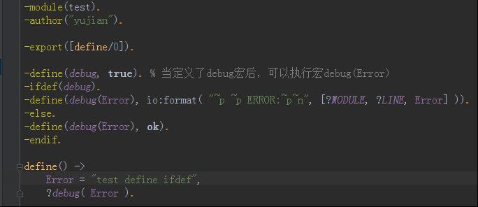
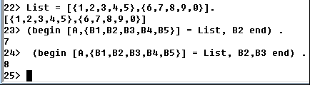
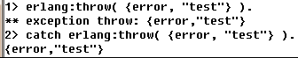
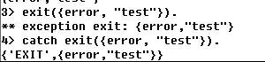
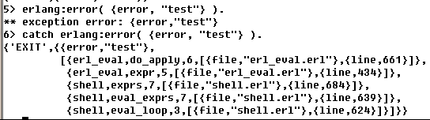

## 注释
注释不会被编译

单行注释，你可以在任何地方使用以 %% 开头的单行注释。
多行注释等同于单行注释

```erlang
%%
```

* * * * *

## if
```erlang
test(A, B) ->
	if 
    	(A > 1) andalso (B > 1) -> 1;
        true -> 2
    end.
```
* if语句会对Guard子句做catch,所以 if 1/0 ->a; true ->b end.的返回值是b而不是抛出异常
* if的Guard子句放在变量里就可以让异常抛出来:G=1/0 , if G->a; true ->b end.
* Guard subexpressions resulting in a runtime error are treated as returning false.
* Guard可以使用, ; 表达多个条件if X=:=1,Y<2;X+Y<4 ->ok; true ->error end.

## case

```erlang
a(Arg) ->
	case Arg of
    	undefined -> 
        	A = 1,
            B = 2;
		{ok, arg} ->
        	A = 3,
            B = 4
	end,
    A + B.
```

## 宏的流程控制

```erlang
-undef(Macro) . %取消改宏定义，在这个语句之后不能调用这个宏。
-ifdef(Macro). %只有Macro被定义后，才对该行以下的代码进行运算。
-ifndef(Macro). %只有在不定义Macro的情况下，才对该行以下的代码进行运算。
-else. %只能在-ifdef或-ifndef之后出现，如果条件为false, 那么改语句后的代码才被执行。
-endif. %标记-ifdef或-ifndef语句的结束。
```


## begin...end


## 断言
1.Guard是一种强化模式匹配功能的结构，使用Guard可以在一个模式上做一些简单的变量测试和比较。

2.示例:
max(X, Y) -> when X > Y -> X;
max(X, Y) -> Y.

3.Guard组合关系
 Guard1;Guard2...;Guardn 条件式中每个条件式是or关系。
 Guard1,Guard2...,Guardn 条件式中每个条件式是and关系。
 
4.合法的Guard表达式：
* 原子true。
* 其它常量(字典或者列表中的条目或者绑定变量), 这些在断言表达式中都会被求值为false。
* 断言谓词或者BIF。
* 比较表达式。
* 算数表达式。
* 布尔表达式。
* 短路布尔表达式 

断言谓词
谓词                   含义
is_atom(X)             X是原子
is_binary(X)           X是二进制数据
is_constant(X)         X是常数
is_float(X)            X是浮点数
is_function(X)         X是函数
is_function(X, N)      X是有N个参数的函数
is_integer(X)          X是整数
is list (X)            X是列表
is_number(X)           X是整数或浮点数
is_pid(X)              X是进程标识符
is_port(X)             X是端口
is_reference(X)        X是引用
is_tuple(X)            X是元组
is_record(X,Tag)       X是标记为Tag的记录
is_record(X,Tag,N)    X是标记为Tag大小为N的记录

断言BIF
函数            含义
abs(X)              X的绝对值
element(N,X)        元组X的第N个元素
float(X)            将数字X转换为浮点数
hd(X)               列表X的头部
length(X)           列表X的长度
node()              当前节点
node(X)             创建X的节点，X可以是进程标识符、引用或端口
round(X)            将数字X转换为整数(四舍五入)
self()              当前进程的进程标识符
size(X)             X的大小，X为元组或二进制数据
trunc(X)            将数字X转换为整数(截取)
tl(X)               列表X的尾部


## receive...end
```erlang
receive
    {ClientPid, {table, Table}} ->
        Res = filter( Table ),
        ClientPid ! {mnesiaDBA_pub_clear, Res},
        loop();
    {ClientPid, {stop, Stop}} ->
        ClientPid ! {mnesiaDBA_pub_clear, "pid stopping reason:" ++ hd(io_lib:format( "~p~n", [Stop] ))};
    {ClientPid, Other} ->
        ClientPid ! {mnesiaDBA_pub_clear, "arg is error:" ++ hd(io_lib:format( "~p~n", [Other] ))},
        loop()
after
    10000 -> timeout
end.
```

## try catch
1.erlang:throw(Reason)


2.exit(Reason)


3.erlang:error


```erlang
try Fun of
	{ok, Val} -> Val;
    _   -> []
catch
     Catch:Why:Stk -> []
end.

get_(L )->
         catch 
            lists:map(
                fun( E) -> 
                    if 
                        E == 1 -> throw([ 0]);
                        true ->E  
                    end 
                end,
             L).
B = get_([ 1, 2, 3]).


Fun = 
	fun( X, {Data, Data1} ) -> 
        case X==Data of 
            true -> throw({0,0}); 
            false -> {Data, Data1+X} 
        end 
    end. 
catch lists:foldl( Fun, {5, 0}, Lists).  %Catch的另类用法
{0,0}. 


try_catch(Expr, Handler) ->
    try
        Expr()
    catch
        Catch:Why:Stk ->
            Handler(Catch:Why:Stk)
    end.

try
  Exprs
catch
  something_was_thrown ->
    %% The default class is 'throw'.
  throw:something_else_was_thrown ->
  throw:thrown_with_interesting_stacktrace:Stk ->
    %% The class 'throw' must be explicitly given when
    %% the stacktrace is to be retrieved.
  error:undef ->
    %% Handle an undefined function specially.
  C:E:Stk ->
    %% Log any other exception and rethrow it.
    log_exception(C, E, Stk),
    raise(C, E, Stk)
end.
```

* number<atom<reference<fun<port<pid<tuple<list<binary 之所以有这样一个比较关系,就是为了支持泛型比较=:= =/=精确比较运算不仅比较值,还比较类型,效率更高