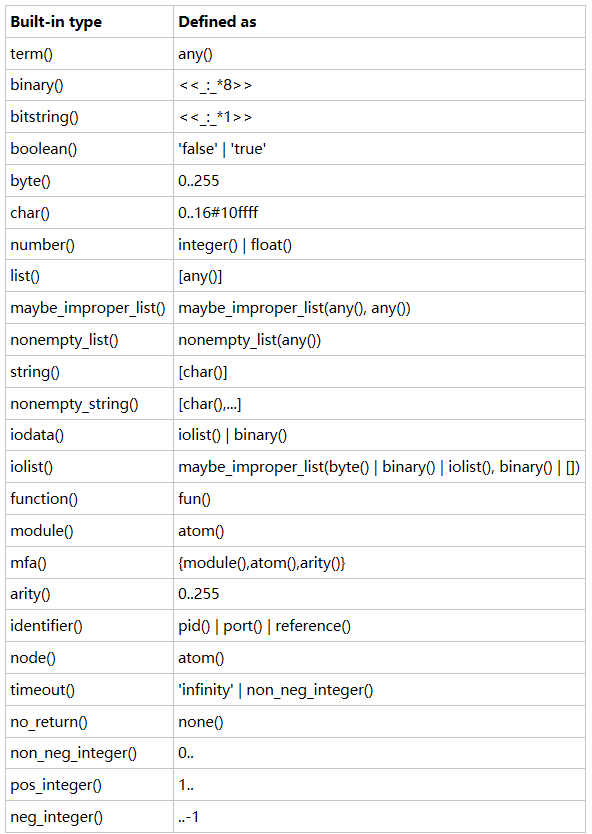

## 模块属性
```erlang
-module(modname).
-import(...).
-export(...).
-compile(Options).
-compile(export_all)%属性经常被使用在调试程序中。
-compile( {parse_transform, Module} ).
-vsn(Version).
    %最后一个选项为增加编译选项，Options可以是单个选项或者选项列表。
-vsn(Version).%中的Version可以是任意字符条目。
```
vim attrs.erl
```erlang
-module(attrs).
-vsn(1234).
-author({joe，armstrong}).
-purpose("example of attributes").

-export( [fac/1]).

-type player_id() :: neg_integer().
-callback fun( PlayerId::player_id() ) -> boolean().

fac(1) -> 1;
fac(N) -> N*fac(N一1).
```

```erlang
$ erlc attrs.erl
$ erl -pa ./
1> attrs:module_info().
[{exports，[{fac，1}，{rnodul a_ info，0}，{rnodul e_i nfo，1}]}，
{imports，[]}，
{attributes，[{vsn，[1234]}，
                {author，[{joe，armstrong}]}，
                {purpose，"example of attributes"}]}，
{compile，[{options，[{cwd，"/home/joe/2006/book/JAERLANG/Book/code"}，
                        {outdir，"/home/joe/2006/book/JAERLANG/Book/code"}]}，
          {version，"4.4.3"}，
          {time，{2007，2，21，19，23，48}}，
          {source，"/home/joe/2006/book/JAERLANG/Book/code/attrs.erl"}]}]
2> attrs:module_info(attributes).
[{vsn，[1234]}，{author，[{joe，armstrong}]}，{purpose，"example of attributes"}]
3> beam_ lib:chunks("attrs.beam"，[attributes])，
{ok，{attrs，[{attributes，[{author，[{joe，armstrong}]}，
                              {purpose，"example of attributes"}，
                          {vsn，[1234]}]}]}}
```

* * * * *

## 类型标注

```erlang
-type tuplelist() -> [tuple()].
-spec fun( integer() ) -> [] | {integer(), TupleList} when TupleList :: [Tuple], Tuple::term().
```
http://www.erlang.org/doc/reference_manual/typespec.html
类型标注后可以只用工具dialyzer来进行分析

* * * * *

## 行为回调函数

例如：
a.erl
```erlang
-type player_id() :: neg_integer().
-callback fun( PlayerId::player_id() ) -> boolean().%必须要在具体函数上面
```
b.erl
```erlang
-behaviour(a).
-export( fun/1 ).
fun(PlayerId) ->
   io:format( "PlayerId:~p~n", [ PlayerId ] ).
```

* * * * *

## Erlang继承

```erlang
-extends(alpha). 

alpha.erl
-module(alpha).
-export([c/2, b/1, a/0]).
a() ->{this_is_module,?MODULE}.
b(S) ->{this_is_module,?MODULE,S}.
c(S,T)->{this_is_module,?MODULE,S,T}.

beta.erl
-module(beta).
-compile(export_all).
-extends(alpha).
show() -> {hello_world,?MODULE,?BASE_MODULE}.
a() ->{hello,?MODULE}.
```

* * * * *


