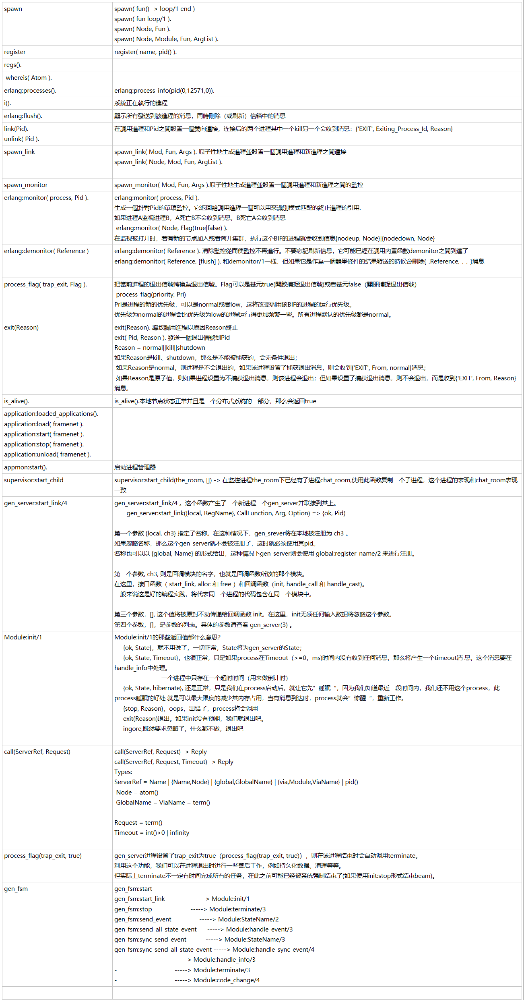

* Erlang的设计哲学是为每一个独立的事件创建一个新进程.
* 负责进程创建职责的是Erlang VM中的Scheduler
* spawn第三个参数是List,这个调用的时候注意!!
* Spawning a process will never fail!!!
* receive子句的处理逻辑抽取为一个独立的方法是推荐的做法
* receive如果接受到没有匹配任何子句的消息,那么这条消息就会保存在mailbox,长此以往就会耗尽内存系统崩溃之险;
* 消息发送的速度快于进程处理的速度就会增加CPU上的消耗,因为会反复扫描mailbox
* Not handling unknown messages should therefore be treated as a bug. 匹配未知消息会导致难以发现错误,所以这些位置要记录日志
* 选择性接受和mailbox这两个东西就解决了消息接受缓冲区的问题
* A race condition occurs when the behavior of a system depends on the order in which certain events occur: these events “race” to influence the behavior.
* 上面两个不失败的设计原则是为了解除进程依赖:另外一个进程的创建和接受消息是否成功不影响当前进程的正常执行
* {'EXIT', Pid, Reason}退出消息的格式包含的信息:谁因为什么退出了
* process_flag(trap_exit, true).退出截获的决策当然是在生命周期的早期进行配置。所以一般出现在init阶段。
* 截获到底做了一件什么事情呢？把退出消息放在进程收件箱中当成一个普通的消息来处理。这就相当于我们把异常信息放在返回结果中的情况
* receive接收并处理退出信号,退出消息被截获就不再传播
* link是双向的,monitor是单向的,被监控的进程死掉后,监控进程会收到 {'DOWN',Reference,process,Pid,Reason} 消息
* 如果接收到{'EXIT', Pid, Reason}的进程没有trap_exit,而且Reason不是normal,这个进程就会终止掉并继续传播这个退出消息
* 所有的BIFs的执行都是原子性的,所以spawn_link不等同于spawn 和 link的组合调用
* {'EXIT', Pid, Reason}Reason如果是kill,关联进程无论是否trap_exit都会死掉
* {'EXIT', Pid, Reason}Reason如果是normal,关联进程trap_exit会收到一条{'EXIT', Pid, normal}消息,如果没有trap_exit什么都不会发生

spawn
spawn( fun() -> loop/1 end )
spawn( fun loop/1 ). 
spawn( Node, Fun ).  
spawn( Node, Module, Fun, ArgList ). 
register
register( name, pid() ). 
regs().

 whereis( Atom ). 

erlang:processes(). 
erlang:process_info(pid(0,12571,0)). 
i().
系統正在執行的進程
erlang:flush(). 
顯示所有發送到該進程的消息，同時刪除（或刷新）信箱中的消息
link(Pid). 
unlink( Pid ).
在調用進程和Pid之間設置一個雙向連接，连接后的两个进程其中一个kill另一个会收到消息：{'EXIT', Exiting_Process_Id, Reason} 
spawn_link
spawn_link( Mod, Fun, Args ). 原子性地生成進程並設置一個調用進程和新進程之間連接 
spawn_link( Node, Mod, Fun, ArgList ). 

spawn_monitor
spawn_monitor( Mod, Fun, Args ).原子性地生成進程並設置一個調用進程和新進程之間的監控 
erlang:monitor( process, Pid ).
erlang:monitor( process, Pid ). 
生成一個針對Pid的單項監控。它返回給調用進程一個可以用來識別模式匹配的終止進程的引用. 
如果进程A监视进程B，A死亡B不会收到消息，B死亡A会收到消息 
 erlang:monitor( Node, Flag(true|false) ). 
在监视被打开时，若有新的节点加入或者离开集群，执行这个BIF的进程就会收到信息{nodeup, Node}|{nodedown, Node} 
erlang:demonitor( Reference )
erlang:demonitor( Reference ). 清除監控從而使監控不再進行。不要忘記刷新信息，它可能已經在調用內置函數demonitor之間到達了 
erlang:demonitor( Reference, [flush] ). 和demonitor/1一樣，但如果它是作為一個競爭條件的結果發送的時候會刪除{_,Reference,_,_,_}消息 

process_flag( trap_exit, Flag ).
把當前進程的退出信號轉換為退出信號。Flag可以是基元true(開啟捕捉退出信號)或者基元false（關閉捕捉退出信號） 
 process_flag(priority, Pri) 
Pri是进程的新的优先级，可以是normal或者low，这将改变调用该BIF的进程的运行优先级。
优先级为normal的进程会比优先级为low的进程运行得更加频繁一些。所有进程默认的优先级都是normal。 
exit(Reason)
exit(Reason). 導致調用進程以原因Reason終止 
exit( Pid, Reason ). 發送一個退出信號到Pid 
Reason = normal||kill||shutdown 
如果Reason是kill、shutdown，那么是不能被捕获的，会无条件退出；  
 如果Reason是normal，则进程是不会退出的，如果该进程设置了捕获退出消息，则会收到{'EXIT', From, normal}消息； 
 如果Reason是原子值，则如果进程设置为不捕获退出消息，则该进程会退出；但如果设置了捕获退出消息，则不会退出，而是收到{'EXIT', From, Reason}消息。 
is_alive().
is_alive().本地节点状态正常并且是一个分布式系统的一部分，那么会返回true
application:loaded_applications(). 
application:load( framenet ). 
application:start( framenet ). 
application:stop( framenet ). 
application:unload( framenet ). 

appmon:start(). 
启动进程管理器 
supervisor:start_child
supervisor:start_child(the_room, []) -> 在监控进程the_room下已经有子进程chat_room,使用此函数复制一个子进程，这个进程的表现和chat_room表现一致
gen_server:start_link/4
gen_server:start_link/4 。这个函数产生了一个新进程一个gen_server并联接到其上。 
       gen_server:start_link({local, RegName}, CallFunction, Arg, Option) => {ok, Pid}   

第一个参数 {local, ch3} 指定了名称。在这种情况下，gen_srever将在本地被注册为 ch3 。 
如果忽略名称，那么这个gen_server就不会被注册了，这时就必须使用其pid。
名称也可以以 {global, Name} 的形式给出，这种情况下gen_server则会使用 global:register_name/2 来进行注册。 

第二个参数, ch3, 则是回调模块的名字，也就是回调函数所放的那个模块。 
在这里，接口函数（ start_link, alloc 和 free ）和回调函数（init, handle_call 和 handle_cast)。
一般来说这是好的编程实践，将代表同一个进程的代码包含在同一个模块中。 

第三个参数，[], 这个值将被原封不动传递给回调函数 init。在这里，init无须任何输入数据将忽略这个参数。 
第四个参数，[]，是参数的列表。具体的参数请查看 gen_server(3) 。
Module:init/1
Module:init/1的那些返回值都什么意思？  
     {ok, State}，就不用说了，一切正常，State将为gen_server的State；  
     {ok, State, Timeout}，也很正常，只是如果process在Timeout（>=0，ms)时间内没有收到任何消息，那么将产生一个timeout消 息，这个消息要在handle_info中处理。  
                           一个进程中只存在一个超时时间（用来做倒计时） 
     {ok, State, hibernate}, 还是正常，只是我们在process启动后，就让它先”睡眠“，因为我们知道最近一段时间内，我们还不用这个process，此process睡眠的好处 就是可以最大限度的减少其内存占用，当有消息到达时，process就会”惊醒“，重新工作。 
     {stop, Reason}，oops，出错了，process将会调用 
     exit(Reason)退出。如果init没有预期，我们就退出吧。  
     ingore,既然要求忽略了，什么都不做，退出吧 

call(ServerRef, Request)
call(ServerRef, Request) -> Reply 
call(ServerRef, Request, Timeout) -> Reply  
Types: 
ServerRef = Name | {Name,Node} | {global,GlobalName} | {via,Module,ViaName} | pid() 
 Node = atom() 
 GlobalName = ViaName = term() 
 
Request = term() 
Timeout = int()>0 | infinity 

process_flag(trap_exit, true)
gen_server进程设置了trap_exit为true（process_flag(trap_exit, true)），则在该进程结束时会自动调用terminate。
利用这个功能，我们可以在进程退出时进行一些善后工作，例如持久化数据、清理等等。
但实际上terminate不一定有时间完成所有的任务，在此之前可能已经被系统强制结束了(如果使用init:stop形式结束beam)。
gen_fsm
gen_fsm:start
gen_fsm:start_link                -----> Module:init/1
gen_fsm:stop                      -----> Module:terminate/3
gen_fsm:send_event                -----> Module:StateName/2
gen_fsm:send_all_state_event      -----> Module:handle_event/3
gen_fsm:sync_send_event           -----> Module:StateName/3
gen_fsm:sync_send_all_state_event -----> Module:handle_sync_event/4
-                                 -----> Module:handle_info/3
-                                 -----> Module:terminate/3
-                                 -----> Module:code_change/4


```erlang
register(num_generator, spawn_opt(?MODULE, init, [],[{priority,high},{scheduler,0},{min_heap_size, 65536 * 2},{min_bin_vheap_size,65536 * 2}])).

%%参数讲解:
1.priority 
	erlang是公平调度策略，因此默认情况下每个进程得到的运行时间片是相同的：2000reductions,但是对于我们的应用场景来说，这个进程应该是优先级较高的，需要得到更多的调度，因此设置为high,还可以设置为max,但是max是系统进程的预留优先级，用high即可

2. scheduler 
	将该进程绑定到指定的scheduler上，防止进程的任务被scheduler分配来分配去，可以减少CPU调用,注意这个和+sbt db是不同的，+sbt db是防治调度器的任务队列在CPU线程间跃迁，scheduler是为了防止进程在时间片切换过程中被分配给其它的调度器

3.min_heap_size
	进程初始堆大小，用内存换CPU的典型做法，增大初始大小，可以显著降低GC次数和内存再分配次数

4.min_bin_vheap_size
	进程初始二进制堆大小，当该进程对于binary数据的处理交换很多时，可以获得和增大min_heap_size一样的效果
```
