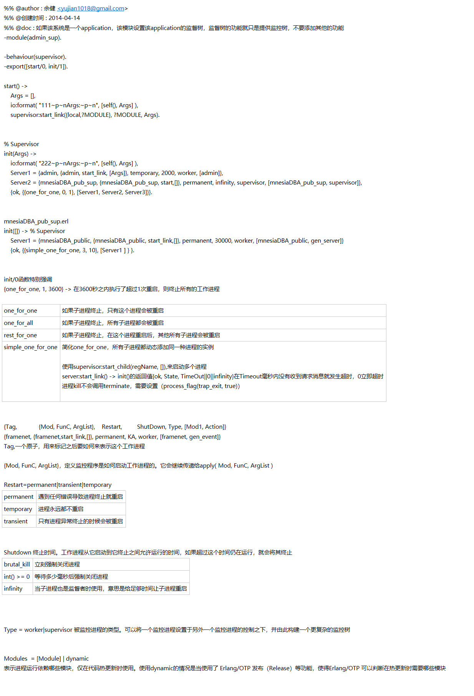

```erlang
%% @author : 余健 <yujian1018@gmail.com>
%% @创建时间 : 2014-04-14
%% @doc : 如果该系统是一个application，该模块设置该application的监督树，监督树的功能就只是提供监控树，不要添加其他的功能
-module(admin_sup).

-behaviour(supervisor).
-export([start/0, init/1]).

start() -> 
    Args = [], 
    io:format( "111~p~nArgs:~p~n", [self(), Args] ),     
    supervisor:start_link({local,?MODULE}, ?MODULE, Args).


% Supervisor 
init(Args) ->  
    io:format( "222~p~nArgs:~p~n", [self(), Args] ), 
    Server1 = {admin, {admin, start_link, [Args]}, temporary, 2000, worker, [admin]}, 
    Server2 = {mnesiaDBA_pub_sup, {mnesiaDBA_pub_sup, start,[]}, permanent, infinity, supervisor, [mnesiaDBA_pub_sup, supervisor]}, 
    {ok, {{one_for_one, 0, 1}, [Server1, Server2, Server3]}}.


mnesiaDBA_pub_sup.erl
init([]) -> % Supervisor 
    Server1 = {mnesiaDBA_public, {mnesiaDBA_public, start_link,[]}, permanent, 30000, worker, [mnesiaDBA_public, gen_server]} 
    {ok, {{simple_one_for_one, 3, 10}, [Server1 ] } }. 

```
init/0函数特别强调
{one_for_one, 1, 3600} -> 在3600秒之内执行了超过1次重启，则终止所有的工作进程

one_for_one	如果子进程终止，只有这个进程会被重启
one_for_all	如果子进程终止，所有子进程都会被重启
rest_for_one	如果子进程终止，在这个进程重启后，其他所有子进程会被重启
simple_one_for_one	简化one_for_one，所有子进程都动态添加同一种进程的实例
	
	使用supervisor:start_child(regName, []),来启动多个进程
	server:start_link() -> init()的返回值{ok, State, TimeOut||0||infinity}在Timeout毫秒内没有收到请求消息就发生超时，0立即超时
	进程kill不会调用terminate，需要设置（process_flag(trap_exit, true)）
	


{Tag,             {Mod, FunC, ArgList},    Restart,         ShutDown, Type, [Mod1, Action]}
{framenet, {framenet,start_link,[]}, permanent, KA, worker, [framenet, gen_event]}
Tag,一个原子，用来标记之后要如何来表示这个工作进程

{Mod, FunC, ArgList}，定义监控程序是如何启动工作进程的。它会继续传递给apply( Mod, FunC, ArgList )

Restart=permanent|transient|temporary
permanent	遇到任何错误导致进程终止就重启
temporary	进程永远都不重启
transient	只有进程异常终止的时候会被重启


Shutdown 终止时间。工作进程从它启动到它终止之间允许运行的时间，如果超过这个时间仍在运行，就会将其终止
brutal_kill	立刻强制关闭进程
int() >= 0	等待多少毫秒后强制关闭进程
infinity	当子进程也是监督者时使用，意思是给足够时间让子进程重启


Type = worker|supervisor 被监控进程的类型。可以将一个监控进程设置于另外一个监控进程的控制之下，并由此构建一个更复杂的监控树


Modules  = [Module] | dynamic
表示进程运行依赖哪些模块，仅在代码热更新时使用。使用dynamic的情况是当使用了 Erlang/OTP 发布（Release）等功能，使得Erlang/OTP 可以判断在热更新时需要哪些模块
