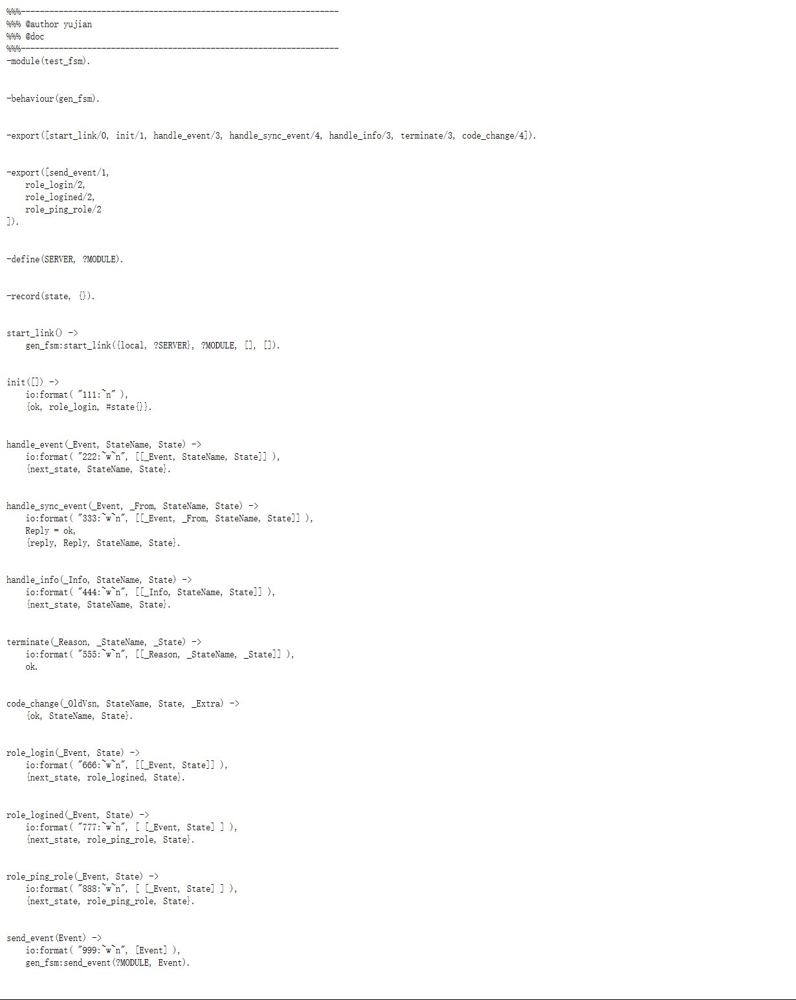

```erlang
%%%------------------------------------------------------------------- 
%%% @author yujian 
%%% @doc 
%%%------------------------------------------------------------------- 
-module(test_fsm). 
 

-behaviour(gen_fsm). 

 
-export([start_link/0, init/1, handle_event/3, handle_sync_event/4, handle_info/3, terminate/3, code_change/4]). 

 
-export([send_event/1, 
    role_login/2, 
    role_logined/2, 
    role_ping_role/2 
]). 

 
-define(SERVER, ?MODULE). 

  
-record(state, {}). 

  
start_link() -> 
    gen_fsm:start_link({local, ?SERVER}, ?MODULE, [], []). 
 
 
init([]) -> 
    io:format( "111:~n" ), 
    {ok, role_login, #state{}}. 
 
 
handle_event(_Event, StateName, State) -> 
    io:format( "222:~w~n", [[_Event, StateName, State]] ), 
    {next_state, StateName, State}. 
 
 
handle_sync_event(_Event, _From, StateName, State) -> 
    io:format( "333:~w~n", [[_Event, _From, StateName, State]] ), 
    Reply = ok, 
    {reply, Reply, StateName, State}. 
 
 
handle_info(_Info, StateName, State) -> 
    io:format( "444:~w~n", [[_Info, StateName, State]] ), 
    {next_state, StateName, State}. 
 
 
terminate(_Reason, _StateName, _State) -> 
    io:format( "555:~w~n", [[_Reason, _StateName, _State]] ), 
    ok. 
 
 
code_change(_OldVsn, StateName, State, _Extra) -> 
    {ok, StateName, State}. 
 
 
role_login(_Event, State) -> 
    io:format( "666:~w~n", [[_Event, State]] ), 
    {next_state, role_logined, State}. 
 
 
role_logined(_Event, State) -> 
    io:format( "777:~w~n", [ [_Event, State] ] ), 
    {next_state, role_ping_role, State}. 
 
 
role_ping_role(_Event, State) -> 
    io:format( "888:~w~n", [ [_Event, State] ] ), 
    {next_state, role_ping_role, State}. 
 
 
send_event(Event) -> 
    io:format( "999:~w~n", [Event] ), 
    gen_fsm:send_event(?MODULE, Event). 
 

```