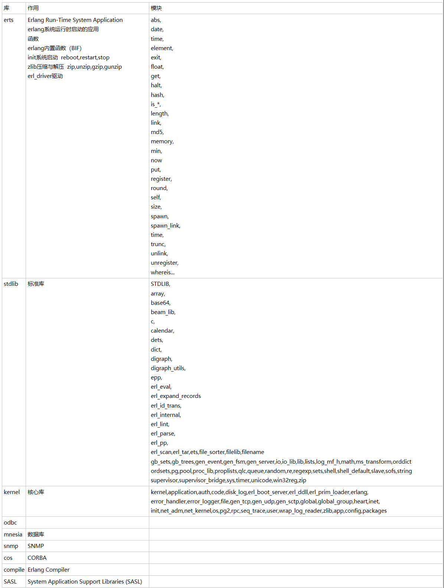

```erlang

库
作用
模块
erts
Erlang Run-Time System Application
erlang系统运行时启动的应用
函数
erlang内置函数（BIF）
init系统启动  reboot,restart,stop
zlib压缩与解压  zip,unzip,gzip,gunzip
erl_driver驱动
abs,
date,
time,
element,
exit,
float,
get,
halt,
hash,
is_*,
length,
link,
md5,
memory,
min,
now
put,
register,
round,
self,
size,
spawn,
spawn_link,
time,
trunc,
unlink,
unregister,
whereis...
stdlib
标准库
STDLIB,
array,
base64,
beam_lib,
c,
calendar,
dets,
dict,
digraph,
digraph_utils,
epp,
erl_eval,
erl_expand_records
erl_id_trans,
erl_internal,
erl_lint,
erl_parse,
erl_pp,
erl_scan,erl_tar,ets,file_sorter,filelib,filename
gb_sets,gb_trees,gen_event,gen_fsm,gen_server,io,io_lib,lib,lists,log_mf_h,math,ms_transform,orddict
ordsets,pg,pool,proc_lib,proplists,qlc,queue,random,re,regexp,sets,shell,shell_default,slave,sofs,string
supervisor,supervisor_bridge,sys,timer,unicode,win32reg,zip
kernel
核心库
kernel,application,auth,code,disk_log,erl_boot_server,erl_ddll,erl_prim_loader,erlang,
error_handler,error_logger,file,gen_tcp,gen_udp,gen_sctp,global,global_group,heart,inet,
init,net_adm,net_kernel,os,pg2,rpc,seq_trace,user,wrap_log_reader,zlib,app,config,packages
odbc


mnesia
数据库

snmp
SNMP

cos
CORBA

compile
Erlang Compiler

SASL
System Application Support Libraries (SASL)

```