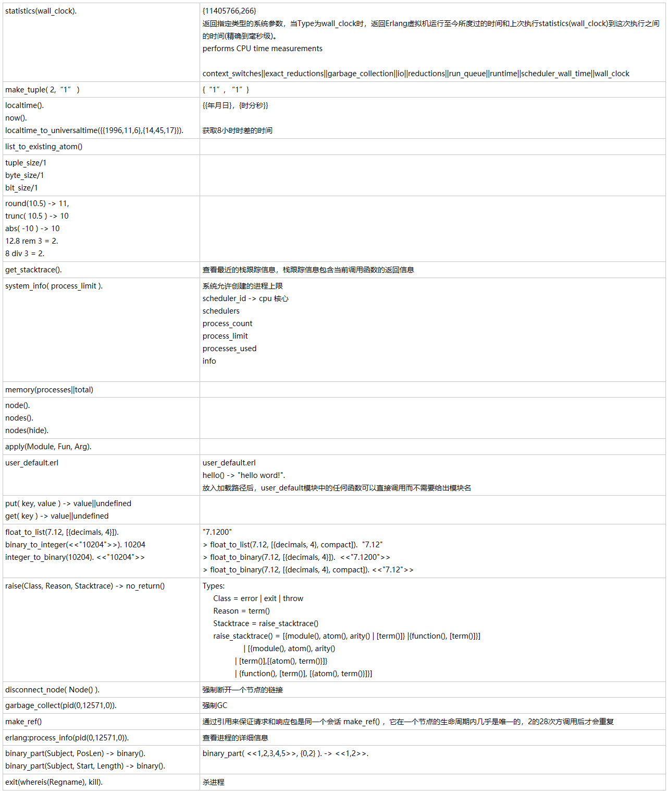

* apply(M,F,A)要比直接调用调用对应的方法M:F(A1,A2...)要慢6~10倍，尽量避免使用
* BIFs是built-in functions的缩写代表这些方法是Erlang运行时系统的一部分
```erlang
%% binary_to_list VS bitstring_to_list
1> A = <<1:2, 23:6>>.
<<"W">>
2> B = <<1:2, 23:5>>.
<<55:7>>
3> binary_to_list(A).
"W"
4> binary_to_list(B).
** exception error: bad argument
in function binary_to_list/1
called as binary_to_list(<<55:7>>)
5> bitstring_to_list(A).
"W"
6> bitstring_to_list(B).
[<<55:7>>]
```


```erlang
statistics(wall_clock).  
{11405766,266}
返回指定类型的系统参数，当Type为wall_clock时，返回Erlang虚拟机运行至今所度过的时间和上次执行statistics(wall_clock)到这次执行之间的时间(精确到毫秒级)。
performs CPU time measurements 

context_switches||exact_reductions||garbage_collection||io||reductions||run_queue||runtime||scheduler_wall_time||wall_clock
make_tuple( 2,“1” )
{“1”, “1”}
localtime().
now().
localtime_to_universaltime({{1996,11,6},{14,45,17}}).
{{年月日}，{时分秒}}

获取8小时时差的时间
list_to_existing_atom()

tuple_size/1
byte_size/1
bit_size/1

round(10.5) -> 11, 
trunc( 10.5 ) -> 10
abs( -10 ) -> 10 
12.8 rem 3 = 2. 
8 div 3 = 2.

get_stacktrace().
查看最近的栈跟踪信息，栈跟踪信息包含当前调用函数的返回信息
system_info( process_limit ).
系统允许创建的进程上限
scheduler_id -> cpu 核心
schedulers
process_count
process_limit
processes_used
info 

memory(processes||total)

node().
nodes().
nodes(hide).

apply(Module, Fun, Arg).

user_default.erl
user_default.erl
hello() -> "hello word!". 
放入加载路径后，user_default模块中的任何函数可以直接调用而不需要给出模块名
put( key, value ) -> value||undefined   
get( key ) -> value||undefined

float_to_list(7.12, [{decimals, 4}]). 
binary_to_integer(<<"10204">>). 10204
integer_to_binary(10204). <<"10204">> 

"7.1200" 
> float_to_list(7.12, [{decimals, 4}, compact]).  "7.12" 
> float_to_binary(7.12, [{decimals, 4}]).  <<"7.1200">> 
> float_to_binary(7.12, [{decimals, 4}, compact]). <<"7.12">> 
raise(Class, Reason, Stacktrace) -> no_return()
Types: 
     Class = error | exit | throw 
     Reason = term() 
     Stacktrace = raise_stacktrace() 
     raise_stacktrace() = [{module(), atom(), arity() | [term()]} |{function(), [term()]}] 
                   | [{module(), atom(), arity() 
               | [term()],[{atom(), term()}]} 
               | {function(), [term()], [{atom(), term()}]}] 
disconnect_node( Node() ). 
强制断开一个节点的链接
garbage_collect(pid(0,12571,0)).
强制GC
make_ref()
通过引用来保证请求和响应包是同一个会话 make_ref() ，它在一个节点的生命周期内几乎是唯一的，2的28次方调用后才会重复
erlang:process_info(pid(0,12571,0)). 
查看进程的详细信息
binary_part(Subject, PosLen) -> binary(). binary_part(Subject, Start, Length) -> binary().
binary_part( <<1,2,3,4,5>>, {0,2} ). -> <<1,2>>. 
exit(whereis(Regname), kill).
杀进程
```

