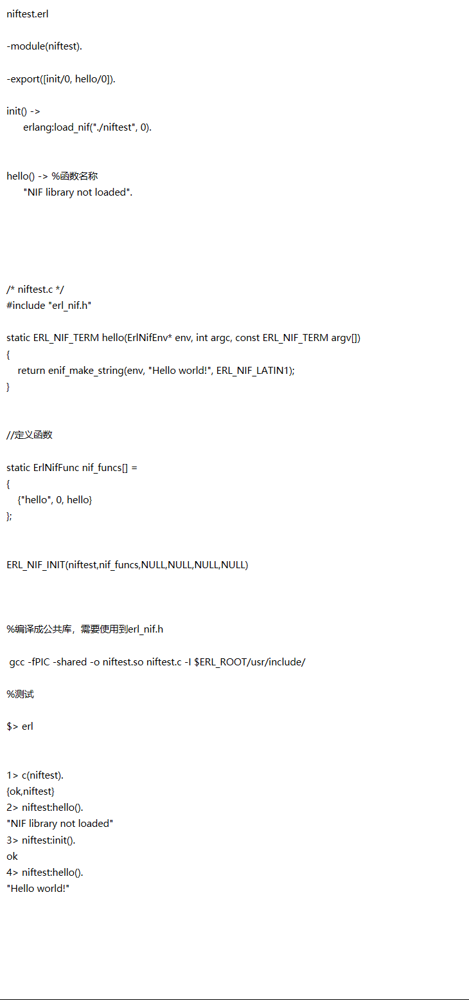

```erlang

niftest.erl 

-module(niftest). 

-export([init/0, hello/0]). 

init() -> 
      erlang:load_nif("./niftest", 0). 
 

hello() -> %函数名称 
      "NIF library not loaded". 

 

 

/* niftest.c */ 
#include "erl_nif.h" 

static ERL_NIF_TERM hello(ErlNifEnv* env, int argc, const ERL_NIF_TERM argv[]) 
{ 
    return enif_make_string(env, "Hello world!", ERL_NIF_LATIN1); 
} 
 

//定义函数 

static ErlNifFunc nif_funcs[] = 
{ 
    {"hello", 0, hello} 
}; 
 

ERL_NIF_INIT(niftest,nif_funcs,NULL,NULL,NULL,NULL) 

 

%编译成公共库，需要使用到erl_nif.h 

 gcc -fPIC -shared -o niftest.so niftest.c -I $ERL_ROOT/usr/include/ 

%测试 

$> erl 
 

1> c(niftest). 
{ok,niftest} 
2> niftest:hello(). 
"NIF library not loaded" 
3> niftest:init(). 
ok 
4> niftest:hello(). 
"Hello world!"  
```

