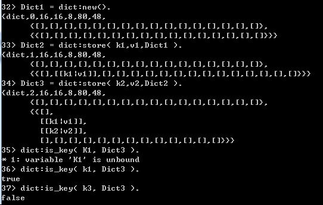

    dict是动态哈希表实现的字典.在接口上和orddict保持一致,在实现上和array动态扩展的思路类似, 与proplists,orddict相比它能够支持更大的数据量,你可以在数据量膨胀的时候从orddict转为dict.dict使用的是动态哈希技术实现,
理论依据是论文: "The Design and Implementation of Dynamic Hashing for Sets and Tables in Icon" ,论文地址: http://www.2007.cccg.ca/~morin/teaching/5408/refs/a99.pdf
    
    数组寻址容易,插入和删除困难;链表寻址困难,插入和删除容易;哈希表插入和删除的时间均取决于查找时间.哈希表在数据和数据存储位置之间建立了确定的函数关系,所以获得了高效的查询效率,而线性表和树,数据项在结构中的位置是随机的,和数据项取值没有确定的关系,这种结构上进行查找数据项是基于"比较",查找效率依赖比较次数.
    参考资料：http://www.cnblogs.com/me-sa/archive/2012/06/24/erlang-dict.html
```erlang
1.Dict = dict:new().
2.dict:store( key, Value, Dict ).
3.dict:is_key( Key, Dict ). -> true | false
4.dict:find(Key, Dict). == dict:fetch( Key, Dict ).

5.dict:fold(Fun, [], Dict).  Fun = fun( I, List ) -> Return = fun(I), [Return | List] end.
6.dict:erase(k1, Dict). 清除Dict中key=k1的数据
7.dict:append( k2,v3, Dict2 ) 向k2追加v3

1.dict可以存储更大的数据
在dict的实现中,Segment,Slot,bucket是三个逐渐逐渐变小的概念
-record(dict, {
  size=0 %元素的数量 
  n=?seg_size % 已经激活的slot数量 
  maxn=?seg_size % 最大slots数 
  bso=?seg_size div 2 %最大bucket数散列表中当前允许的最大 bucket 数量，扩张操作需要据此判断是否要增加新的 bucket 区段，初始为 16； 
  exp_size=?exp_size %扩张阈值 初始值为16*5=80 
  con_size=?con_size %收缩阈值 初始值为16*3=48 
  empty :: tuple(), % Empty segment 
  segs :: tuple() % Segments 所有的数据存放的地方 }).

```
