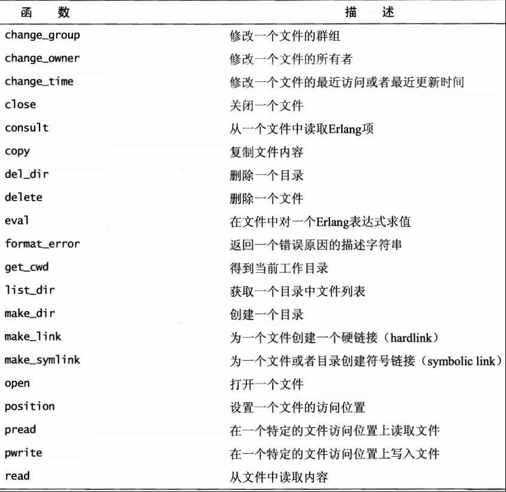
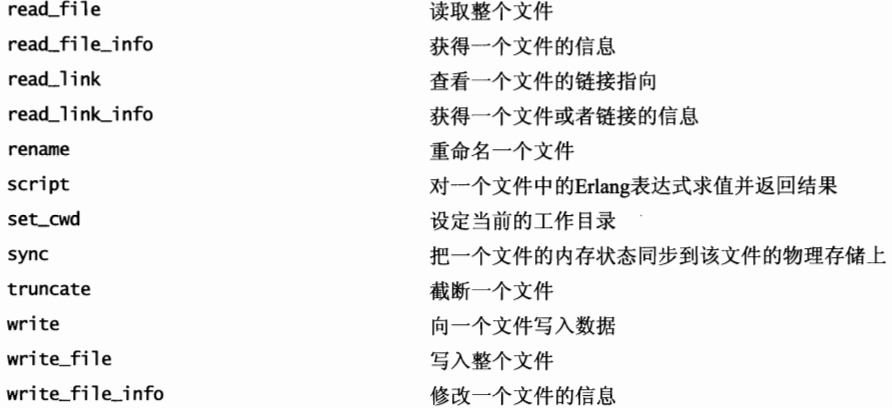

### 写文件 
```erlang
   file:open( FileName, [append]|[write]|[read] )  

    file:open(?FilePath, [write, {encoding, utf8}]) 

    tool_log( Res, State )-> 

        {ok, S} = file:open(get_path("../doc/tool_log.txt"), [append]), 

        io:format( S, "~p:~n{~p, ~p}~n", [ erlang:localtime(), Res, State ]), 

        file:close( S ). 

    file:open(File, [raw, binary]). 

  2.file:write( IoDevice, Bytes ). 

  file:write_file( FileName, Bytes ). 可以保存图片 
```
  
###读文件 

```erlang
file:open( FileName, read ). 

{ok,<0.547.0>} 

io:read( <0.547.0>, '' ). 

{ok,{1,"买星马AK-8880"}}
  ile:read_file(FileName )  

      file:read_file( "E:\a.xml" ). {ok,<<"<xml>\r\n<name>yujian</name>\r\n</xml>">>} 

  file:consult( FileName  )   

        case file:consult( Doc ) of 

        {ok, [FileConent]} -> FileConent; 

        Other -> Other 

        end. 

     file:consult可以直接把文件中的Erlang项读取出来 
file:list_dir(Docs) 列出当先文件夹下所有的子目录及文件
file:make_dir(Docs) 创建一个新的目录

 
{ok, S} = file:open( "D:/project/minertwo/doc/countrys.txt", [read] ). 

   io:get_line( S, '' ). 

   "中国  蒙古  朝鲜  韩国  日本\n" 

   "菲律宾\t越南\t老挝\t柬埔寨\t缅甸\t泰国\t马来西亚\t文莱\t新加坡\t印度尼西亚\t东帝汶\t\t\t\t\t\t\t\t\n" 

file:delete( Path ). 

file:del_dir(Dir) 

filelib:is_file( Path )  判断是否是一个文件 
```
 

Erlang用于操纵文件I/O的模块有： 

file模块：打开、读、写、关闭文件已经操作目录的方法基本都在这里 

filename模块：提供平台独立方式用于操纵文件名 

filelib模块：file模块的扩展，提供了更多的实用工具，在file模块基础上构建 

io模块：一系列用于操作打开的文件的方法，解析格式、格式化输出等等。 

1.打开文件： 
```erlang
{ok,F}=file:open("data1.dat",read). %读模式打开 

{ok,F}=file:open("data1.dat",write). %写模式 

{ok,F}=file:open("data1.dat",[read,write]). %读、写、二进制模式 
```
支持的所有模式参见文档。 

2.读取： 
```erlang
(1)如果以一个Erlang term的方式读取，采用: 
io:read(F,''). 
其中第二个参数是提示符，用于在标准输入时作为提示。 
这个方法有一个变形read/3 
read(IoDevice, Prompt, StartLine) 
第三个参数用于指定开始行数。 

(2)如果是按字节读取，文件必须按raw模式打开采用： 
    {ok, Data}=file:read(F,100). 

(3)按行读取： 
    io:get_line(F, ''). 

(4)读取整个文件的内容： 
{ok,Binary}=file:read_file("data1.dat"). 
%%注意返回的是一个binary类型 

(5)随机读取： 
{ok,Binary}=file:pread(F, 22, 46). 
%%其中第二个参数是开始位置，第三个参数是读取的长度，返回的也是binary类型。 
```

3.写入文件： 
```erlang
(1)采用io:format/3方法： 
    {ok, S} = file:open("test2.dat", write). 
    io:format(S, "~s~n", ["Hello readers"]). 
    io:format(S, "~w~n", [123]). 
    %%其中的~开头的字符是一个个格式化命令，比如常见的： 

    ~c anscii码 
    ~f 浮点数 
    ~s 字符串 
    ~w Erlang term 
    ~p 与~w类似，不过当多行时将自动换行 
    ~n 显然，换行符 

（2）写入整个文件： 
    file:write_file(File, IO) 
    其中IO可以为list、integer或者binary类型 

（3）随机写入： 
    file:pwrite(F, 10, <<"new">>) 
```
4.关闭文件: 
```erlang
file:close(F). 
```
5.目录操作： 
```erlang
都是linux命令风格的操作， 
cd("/home/dennis/"). %进入目录 
file:list_dir("."). %列出当前目录文件 
file:make_dir("test"). %创建test目录 
file:del_dir("test"). %删除test目录 
```

6.获取文件信息，比如文件大小，最后修改时间等等。
```erlang
%%调用file:read_file_info/1方法，该方法返回一个file_info记录类型，里面拥有文件的具体信息，比如type、size等。 
{ok, Facts} =file:read_file_info(File). 
io:format("~s~n",{Facts#file_info.type, Facts#file_info.size}). 
```

复制和删除文件： 
```erlang
file:copy(Source, Destination). 
file:delete(File).
```
  





