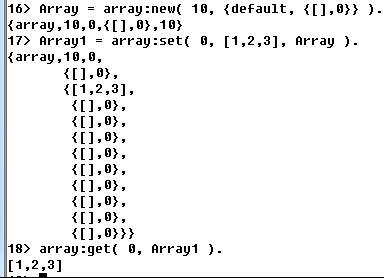

函数式且可扩展的数组模块

内部实现：tuple

1.array:new(10, {default, {[], 0}}). -> {array,10,0,{[],0},10}
2.array:set( 0, [1,2,3], Array2 ). -> Array
3.array:get( 0, Array3 ). -> [1,2,3].
    

4.array:reset(Index, Array). 清空该列
5.array:from_list(Sub)