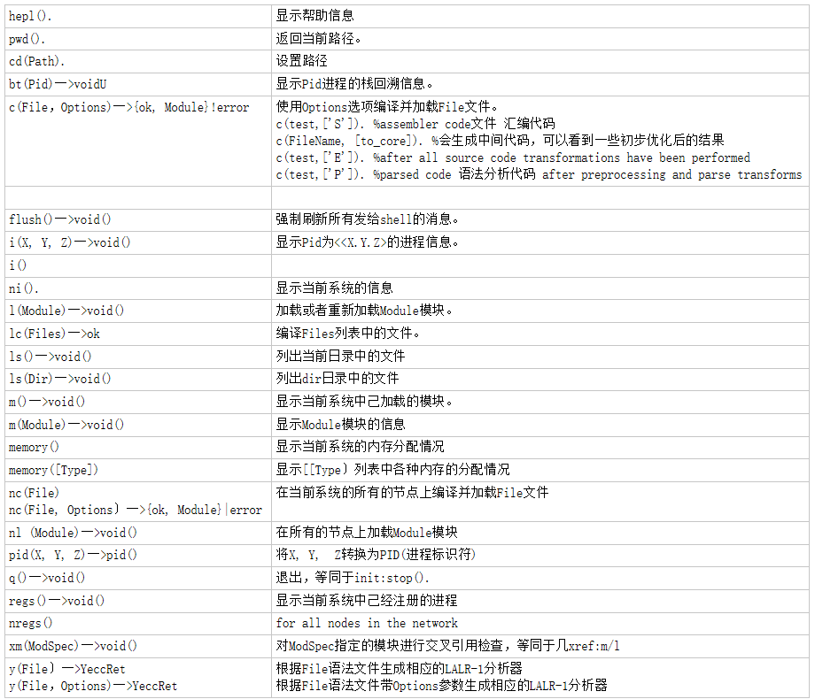

Command Interface Module

hepl().
显示帮助信息
pwd().   
返回当前路径。
cd(Path).  
设置路径
bt(Pid)一>voidU
显示Pid进程的栈回溯信息。
c(File，Options)一>{ok, Module}!error  
使用Options选项编译并加载File文件。
c(test,['S']). %assembler code文件 汇编代码
c(FileName, [to_core]). %会生成中间代码，可以看到一些初步优化后的结果
c(test,['E']). %after all source code transformations have been performed
c(test,['P']). %parsed code 语法分析代码 after preprocessing and parse transforms

flush()一>void()
强制刷新所有发给shell的消息。
i(X, Y, Z)一>void()
显示Pid为<<X.Y.Z>的进程信息。
i() 

ni(). 
显示当前系统的信息
l(Module)一>void() 
加载或者重新加载Module模块。
lc(Files)一>ok
编译Files列表中的文件。
ls()一>void()
列出当前日录中的文件
ls(Dir)一>void()
列出dir日录中的文件
m()一>void()  
显示当前系统中己加载的模块。
m(Module)一>void()
显示Module模块的信息
memory()
显示当前系统的内存分配情况
memory([Type])
显示[[Type〕列表中各种内存的分配情况
nc(File)
nc(File, Options〕一>{ok, Module}|error
在当前系统的所有的节点上编译并加载File文件
nl (Module)一>void()
在所有的节点上加载Module模块
pid(X, Y, Z)一>pid()
将X, Y,  Z转换为PID(进程标识符)
q()一>void()
退出，等同于init:stop().
regs()一>void()
显示当前系统中己经注册的进程
nregs()
for all nodes in the network
xm(ModSpec)一>void()
对ModSpec指定的模块进行交叉引用检查，等同于几xref:m/l
y(File〕一>YeccRet
y(File，Options)一>YeccRet
根据File语法文件生成相应的LALR-1分析器
根据File语法文件带Options参数生成相应的LALR-1分析器
