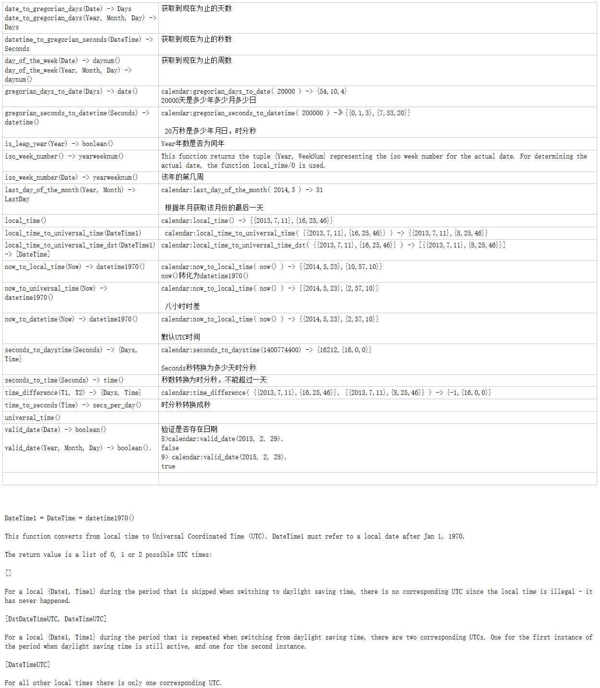

 
 ```erlang
date_to_gregorian_days(Date) -> Days  获取到现在为止的天数
date_to_gregorian_days(Year, Month, Day) -> Days  
datetime_to_gregorian_seconds(DateTime) -> Seconds  获取到现在为止的秒数
day_of_the_week(Date) -> daynum() 获取到现在为止的周数
day_of_the_week(Year, Month, Day) -> daynum()
gregorian_days_to_date(Days) -> date()  calendar:gregorian_days_to_date( 20000 ) -> {54,10,4}
  20000天是多少年多少月多少日
gregorian_seconds_to_datetime(Seconds) -> datetime()  calendar:gregorian_seconds_to_datetime( 200000 ) -》{{0,1,3},{7,33,20}}  
 
 20万秒是多少年月日，时分秒
is_leap_year(Year) -> boolean() Year年数是否为闰年
iso_week_number() -> yearweeknum()  This function returns the tuple {Year, WeekNum} representing the iso week number for the actual date. For determining the actual date, the function local_time/0 is used.
iso_week_number(Date) -> yearweeknum()  该年的第几周
last_day_of_the_month(Year, Month) -> LastDay calendar:last_day_of_the_month( 2014,3 ) -> 31  
 
 根据年月获取该月份的最后一天
local_time()  calendar:local_time() -> {{2013,7,11},{16,25,46}}
local_time_to_universal_time(DateTime1)  calendar:local_time_to_universal_time( {{2013,7,11},{16,25,46}} ) -> {{2013,7,11},{8,25,46}}
local_time_to_universal_time_dst(DateTime1) -> [DateTime] calendar:local_time_to_universal_time_dst( {{2013,7,11},{16,25,46}} ) -> [{{2013,7,11},{8,25,46}}]
now_to_local_time(Now) -> datetime1970()  calendar:now_to_local_time( now() ) -> {{2014,5,23},{10,57,10}}
  now()转化为datetime1970()
now_to_universal_time(Now) -> datetime1970()  calendar:now_to_local_time( now() ) -> {{2014,5,23},{2,57,10}}  
 
 八小时时差
now_to_datetime(Now) -> datetime1970()  calendar:now_to_local_time( now() ) -> {{2014,5,23},{2,57,10}}  
 
默认UTC时间
seconds_to_daystime(Seconds) -> {Days, Time}  calendar:seconds_to_daystime(1400774400) -> {16212,{16,0,0}}  
 
Seconds秒转换为多少天时分秒
seconds_to_time(Seconds) -> time()  秒数转换为时分秒，不能超过一天
time_difference(T1, T2) -> {Days, Time} calendar:time_difference( {{2013,7,11},{16,25,46}}, {{2013,7,11},{8,25,46}} ) -> {-1,{16,0,0}}
time_to_seconds(Time) -> secs_per_day() 时分秒转换成秒
universal_time()  
valid_date(Date) -> boolean()  
 
valid_date(Year, Month, Day) -> boolean().  验证是否存在日期
  8>calendar:valid_date(2015, 2, 29). 
  false
9> calendar:valid_date(2015, 2, 28).
true
  


DateTime1 = DateTime = datetime1970() 

This function converts from local time to Universal Coordinated Time (UTC). DateTime1 must refer to a local date after Jan 1, 1970. 

The return value is a list of 0, 1 or 2 possible UTC times: 

[] 

For a local {Date1, Time1} during the period that is skipped when switching to daylight saving time, there is no corresponding UTC since the local time is illegal - it has never happened. 

[DstDateTimeUTC, DateTimeUTC] 

For a local {Date1, Time1} during the period that is repeated when switching from daylight saving time, there are two corresponding UTCs. One for the first instance of the period when daylight saving time is still active, and one for the second instance. 

[DateTimeUTC] 

For all other local times there is only one corresponding UTC. 

```