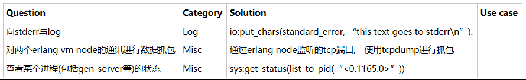
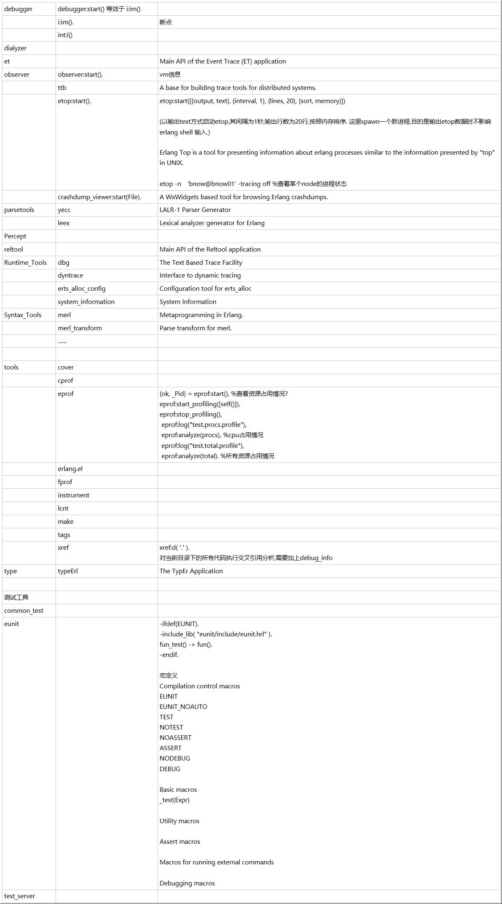

## 1.
ERTS Erlang Runtime System Application 运行
 -----------------------------------------------------
 epmd(Erlang Port Mapper Daemon )
 erl运行命令
 erlc编译命令
 werl运行窗口
 escript不编译直接运行
 erlsrv运行Erlang为Windows服务
 start_erl启动嵌入式
 run_erl在Solaris上重定向IO
 start在Unix上启动
 -----------------------------------------------------
SASL System Architecture Support Libraries 报警和发布处理

## 2.接口：
asn1  文法
crypto  加密
gs  图形
inets  网络服务：inets,ftp,tftp,http,httpd,httpd_conf,httpd_socket,httpd_util,mod_alias,mod_auth,mod_esi,mod_security
jinterface Java接口
megaco
public_key 公钥
ssh  SSH：ssh,ssh_channel,ssh_connection,ssh_sftp,ssh_sftpd
ssl  SSL
wx  窗口编程
xmerl  支持XML：xmerl_scan,xmerl,xmerl_xs,xmerl_eventp,xmerl_xpath,xmerl_xsd
erl_interface C接口
 SSH主要用于远程管理网络设备（相对应协议是TELNET）
 SSL主要用于浏览器与WEB服务器之间交互（相对应协议是HTTP）

## 3.

## 4.	
