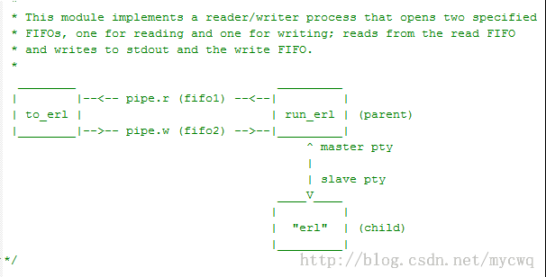

进入已经启动的节点方法:

## 作业（JCL ）模式

使用该功能需要保证cookie一致,并且node的名字的IP保持一致
```erlang
$ erl -setcookie abc -name node_1@192.168.1.110
Eshell V5.9 (abort with ^G) 


$ erl -setcookie abc -name node_2@192.168.1.110
Eshell V5.9 (abort with ^G) 
(node_2@192.168.1.110)1> node(). %当前这是在node_2 
'node_2@192.168.1.110' 
(node_2@192.168.1.110)2> %Ctrl + G 进入JCL模式 
 User switch command 
--> h 
  c [nn] - connect to job 
  i [nn] - interrupt job 
  k [nn] - kill job 
  j - list all jobs 
  s [shell] - start local shell 
  r [node [shell]] - start remote shell 
  q - quit erlang 
  ? | h - this message 
--> r'node_1@192.168.1.110' %尝试连接到node_1@192.168.1.110 
--> j 
   1 {shell,start,[init]} %列出所有的Job 
   2* {'node_1@192.168.1.110',shell,start,[]} 
--> c 2 %这里2是job的编号,切换到job 2 
```


## erl启动参数remsh
```erlang
$ erl -setcookie abc -name node_3@192.168.1.110 -remsh node_1@192.168.1.110 %%这样就直接进入了node_1节点
```

## erl内置SSH 模式	

```erlang
Eshell V5.10.3  (abort with ^G)
(1@127.0.0.1)1> ssh:start().
ok
(1@127.0.0.1)2> ssh:daemon(8888, [{password, "12345"}]).
{ok,<0.57.0>}

%%本地不需要启动erlang节点，直接使用ssh连接即可，输入以上设置的密码，就可以接入节点1的shell控制台。
$ ssh -p 8888 1@127.0.0.1
1@127.0.0.1's password:
Eshell V5.10.3  (abort with ^G)
(1@127.0.0.1)1> 

%%这种方式，erlang shell所有操作都是在远程节点完成的。	
```

## 管道（pipe）模式	
在使用管道（pipe）连接到一个Erlang节点时，和SSH一样不需要启动本地erlang节点。这种方法很少用，每次输出时都调用fsync，如果输出过多时，会有很大的性能损失。



具体做法为：用 run_erl 启动 erlang，相当于把 erlang 进程包在一个管道中：
```shell
$ mkdir /tmp/erl_log
$ cd /home/erl/bin
$ ./run_erl -daemon /tmp/erl_pipe /tmp/erl_log "erl -name 1@127.0.0.1 -setcookie abc"

#其中，daemon 表示以后台进程运行，/tmp/erl_pipe是管道文件的名称，/tmp/erl_log指定了日志保存文件夹

然后使用 to_erl 程序来连接节点： 
$ ./to_erl /tmp/erl_pipe
Attaching to /tmp/erl_pipe (^D to exit) 
(1@127.0.0.1)1> node(). 
'1@127.0.0.1'
```