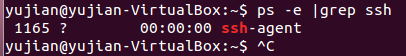

### 流程：
1. 确保所有的服务器开通ssh服务。
2. 确保主节点服务器可以不使用密码直接链接到从节点
3. 确保主节点服务器使用xw.config配置启动Erl节点，确保xw.config中配置了所有节点的Ip，以及使用erl_boot_server启动节点
4. 注意事项：
	保证启动Erlang的linux的用户名所有服务器都一样
    保证Erlang安装路径所有服务器都一样


### 技术文档：
1. Server:
	引导服务器 erl_boot_server
	%server操作模块，配置加入到主节点的从节点，只有定义该节点后，才能被调用 http://erlang.org/doc/man/erl_boot_server.html  
    
	start_boot_server， boot_server_slaves
    %erlang start启动时的options http://erlang.org/doc/man/kernel_app.htm
2. Client:
	从节点：http://erlang.org/doc/man/slave.html 
    %启动从节点的模块。

参考资料
http://cryolite.iteye.com/blog/381758
http://avindev.iteye.com/blog/100113
http://cryolite.iteye.com/blog/376893


详细流程，以ubuntu12.04-client为例：
1.确保server服务器开通ssh服务。
 ~$ps -e |grep ssh


 说明只有ssh客户端，能够登陆其他带有ssh服务端的服务器.
 安装ssh-server
 ~$sudo apt-get install openssh-server
 ~$ps -e |grep ssh
    

 安装成功

2.确保所有服务器之间可以不使用密码直接互联ssh。ubuntu下安装ssh后会提示输入用户密码
   1.生成密匙对。
        密匙 从A -> 拷贝到B,A可以不用密码链接到B
#ssh-keygen -t rsa //一路回车在当前用户的根目录下的.ssh目录生成id_rsa.pub公钥 
 

2.将公钥放到服务器上（注意存放目录位置）
#scp ~/.ssh/id_rsa.pub 用户名@你的服务器的ip:~/.ssh/authorized_keys
//将本地生成的公钥拷贝到远程服务器的下并改名为authorized_keys，authorized_keys的权限设置为600，目前的权限是416没有影响


3.ssh Ip -l user
        使用user用户登录到ip主机上
4.exit.退出ssh
	
	如果无法直接输入密码登录到ssh
	复制密钥
	主机生成密钥
	复制到从机上。具体待验证，重点：known_hosts文件


3.测试

Serve：

```shell
vim xw.config
[
    {kernel, [{start_boot_server, true}, %设置为true，开启该功能
              {boot_server_slaves, ['192.168.0.234', '192.168.0.219']}]} %配置从节点，只有配置后才可能链接
].
%参数 -kernel start_boot_server true boot_server_slaves '[{10,0,0,253},{10,0,0,252}]' 是让主节点成为引导服务器，从节点的beam程序都将从主节点传送。

erl -name server@192.168.0.219  %设置节点名称
    -setcookie 'xw'             %设置cookie
    -config "D:/xw.config"      %使用该配置文档打开
    -rsh ssh                    %参数-rsh ssh是为了让主节点远程启动从节点（slave）必须的
slave:start_link( Host, Name, Args ).
slave:start('10.0.0.252', slave1, "-setcookie abc -loader inet -hosts '10.0.0.253' -id master@10.0.0.253"). 开启从节点10.0.0.252
```
出现错误
a.

这个一般就是指系统中找不到erl命令，也就是在/usr/bin/或/usr/sbin/或/bin/等path下找不到erl命令
将/usr/local/erlang/lib/erlang/bin/erl 链接到/usr/sbin/erl 
ln /usr/local/erlang/lib/erlang/bin/erl /usr/sbin/erl 
删除链接 rm -r /usr/sbin/erl


Client保证可以启动Erlang
    ln /usr/local/erlang/lib/erlang/bin/erl /usr/bin/erl 

函数：
1.c:nl(hello). 第一次调用hello模块被自动发送到从节点，不过在hello模块修改重新编译后，从节点上还是旧的模块，可以调用该命令广播新模块。 
    目前ubuntu测试机中：
    a.在主节点启动从节点成功
    b.在主节点使用code:add_pathz( "/home/yujian-slave/zt_server/ebin" )添加模块，此时可以在主节点上运行加载的模块，从节点上不能运行.
    c.如果需要在从节点上运行，需要使用c:nl( module ),进行广播。
2.rpc:call( Node, M, F, Args ).
