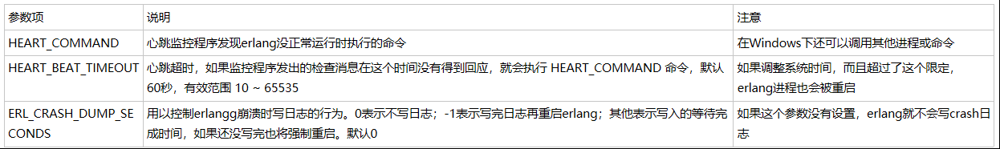

erlang心跳机制
 
什么是erlang心跳机制？这是erlang运行时系统定期监控系统是否正常运行的程序。
erlang为什么要心跳机制？我们都知道，erlang有很多进程监督树，启动了很多supervisor来保证process的高可靠性， 但如果连emulator也死掉了，那erlang也就回天乏术了， 所以这时只能靠heart 来重新启动erlang。

    1. C:\>erl -heart -env HEART_COMMAND "erl -heart"  
    2. Eshell V5.10.2  (abort with ^G)  
    3. 1>  

这时候你可以按 CTRL + C 挂起erlang，或者直接关闭 erlang shell 窗口，系统都会重新打开erlang shell

erlang心跳原理
erlang心跳机制的实现原理是启动一个 heart 进程，通过定时发送特定消息来检查erlang是否正常回应，收不到回应则判断erlang没有正常工作。
erlang心跳参数

参数项 说明  注意
HEART_COMMAND   心跳监控程序发现erlang没正常运行时执行的命令   在Windows下还可以调用其他进程或命令
HEART_BEAT_TIMEOUT  心跳超时，如果监控程序发出的检查消息在这个时间没有得到回应，就会执行 HEART_COMMAND 命令，默认60秒，有效范围 10 ~ 65535   如果调整系统时间，而且超过了这个限定，erlang进程也会被重启
ERL_CRASH_DUMP_SECONDS  用以控制erlangg崩溃时写日志的行为。0表示不写日志；-1表示写完日志再重启erlang；其他表示写入的等待完成时间，如果还没写完也将强制重启。默认0   如果这个参数没有设置，erlang就不会写crash日志

 
 1. % 获取 HEART_COMMAND 命令  
    2. 1> heart:get_cmd().  
    3. {ok,"erl -heart"}  
    4.   
    5. % 设置临时 HEART_COMMAND 命令  
    6. 2> heart:set_cmd("heart -shutdown").  
    7. ok  
    8.   
    9. % 获取 HEART_COMMAND 命令，当临时 HEART_COMMAND 命令设置时取了 临时命令的值  
    10. 3> heart:get_cmd().  
    11. {ok,"heart -shutdown"}  
    12.   
    13. % 清除临时 HEART_COMMAND 命令  
    14. 4> heart:clear_cmd().  
    15. ok  
    16.   
    17. % 获取 HEART_COMMAND 命令  
    18. 5> heart:get_cmd().  
    19. {ok,"erl -heart"}  

也就是说erlang HEART_COMMAND 命令有两种形式：全局环境变量的和临时变量。如果临时命令存在则取执行临时命令。
关闭erlang心跳
有可能我们要临时关闭erlang，对erlang程序进行维护。这时就要就要关闭erlang心跳，否则将无法关闭erlang。关闭erlang心跳方法很简单，如下：
q().

