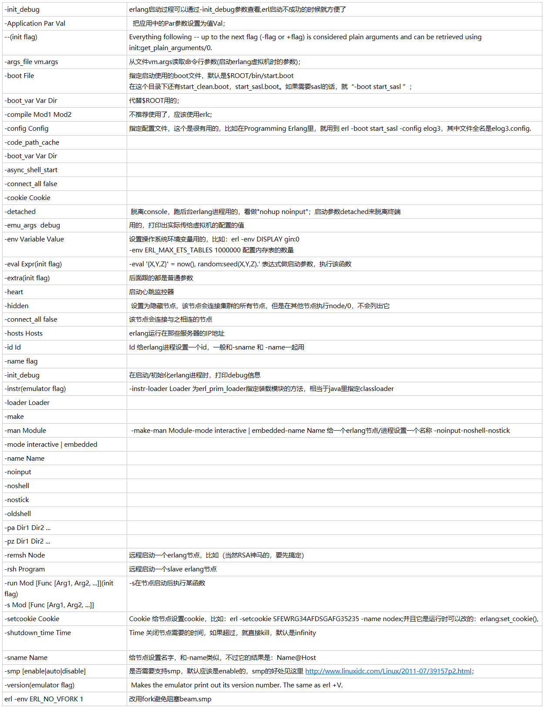

官方文档：http://www.erlang.org/doc/man/erl.html

erlang启动参数有3种：emulator flags, flags 和plain arguments。
 
emulator flags 是以“+”开头的，用来控制虚拟机的行为，附送一个非常实用的例子：
```shell
erl +p  100000 #	最大进程数
erl -pa ebin 
+K true  #开启epoll调度，在linux中开启epoll，会大大增加调度的效率
+A 10  #异步线程池大小默认10
+sbt db  #绑定调度器，绑定后调度器的任务队列不会在各个CPU线程之间跃迁，结合sub使用，可以让CPU负载均衡的同时也避免了大量的跃迁发生。	注意：一个linux系统中，最好只有一个evm开启此选项，若同时有多个erlang虚拟机在系统中运行，还是关闭为好
+sub true #开启CPU负载均衡，false的时候是采用的CPU密集调度策略，优先在某个CPU线程上运行任务，直到该CPU负载较高为止。
+sbwt very_long  #此选项设置为eager后，CPU将更频繁的被唤醒，可以增加CPU利用率
+swt very_low 
+Mulmbcs 32767 
+Mumbcgs 1 
+Musmbcs 2047
+spp true	#开启并行port并行调度队列，当开启后会大大增加系统吞吐量，如果关闭，则会牺牲吞吐量换取更低的延迟。
+zdbbl 65536	分布式erlang的端口buffer大小，当buffer满的时候，向分布式的远程端口发送消息会阻塞
+e Number Ets表的最大数量
+ec 强制Ets表启动压缩
+fnl 如果文件使用了ISO-latin-1编码
+fnu(w|i|e) 文件使用utf8编码
+fna(w|i|e) 和当前系统一致
+hms Size 指定erlang进程的默认最小堆内存大小
+hmbs Size 指定进程默认二进制虚拟内存堆大小
+hpds Size initial process dictionary size
```


flags 是以“-”开头的， 是erlang运行时系统的参数，可以用init:get_argument/1获得。
plain arguments 普通参数，在第一个flag参数前，或在-- flag之后，-extra后的参数都是普通参数。
```shell
erl +W w -sname arnie +R 9 -s my_init -extra +bertie
(arnie@host)1> init:get_argument(sname).
	{ok,[["arnie"]]}
(arnie@host)2> init:get_plain_arguments().
        ["+bertie"]
```



Environment variables

ERL_CRASH_DUMP  设置crash.dump文件的路径
    If the emulator needs to write a crash dump, the value of this variable will be the file name of the crash dump file. If the variable is not set, the name of the crash dump file will be erl_crash.dump in the current directory.

ERL_CRASH_DUMP_NICE
    Unix systems: If the emulator needs to write a crash dump, it will use the value of this variable to set the nice value for the process, thus lowering its priority. The allowable range is 1 through 39 (higher values will be replaced with 39). The highest value, 39, will give the process the lowest priority.

ERL_CRASH_DUMP_SECONDS

ERL_AFLAGS

ERL_ZFLAGS 和 ERL_FLAGS

ERL_LIBS

ERL_EPMD_PORT


让Erlang服务器后台运行
erlang默认运行时是带有终端的，在开发过程中可以很方便的检查程序的bug，但在开发完成后，应该以后台的方式运行服务。
-noshell (该参数关闭终端，但依然不会后台运行，有输出时会直接打印到当前屏幕
-noinput 禁止终端下的输入
-hidden 隐藏运行
-detached 后台方式运行
其实最好用的就是-detached，如果将此参数加入启动脚本，程序会立即进入后台运行，你可以通过进程号将其调入到前台，在加入此参数运行服务器后，查看当前正在运行的程序，你会发现这个参数自动被分解成了 -noshell 和 -noinput, 所以，在加入-detached后，就不需要再加这两个参数了。