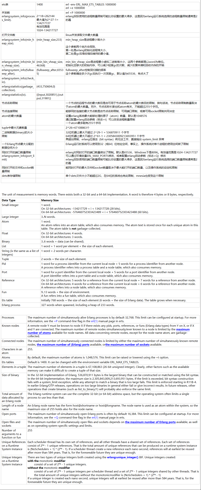

ets表	1400	erl -env ERL_MAX_ETS_TABLES 1000000
		erl +e 1000000
并发数		erl +P 1000000
erlang:system_info(process_limit).	2^18=262144 最大值为2^27-1=134217727	erlang实际使用的进程数量限制可能比你设置的要大得多，这是因为erlang运行系统选择的进程数量限制通常是2的幂
	有效范围是1024-134217727
打开文件数		linux并发读取文件最大数量
erlang:system_info(min_heap_size). 	{min_heap_size,233} 	min_heap_size是进程最小堆大小这个参数两个地方会用到，
		第一处是erlang初始化进程堆大小，
		第二处是gc后堆收缩后维持的最小值，
		
erlang:system_info(min_bin_vheap_size).	{min_bin_vheap_size,46368}	min_bin_vheap_size是进程最小虚拟二进制堆大小，这两个参数都是以word为单位。
		初始化足够大的初始内存，可以减少轻度gc的次数，减少反复申请和回收内存的开销
erlang:system_info(fullsweep_after).  	{fullsweep_after,65535}	fullsweep_after控制深扫描的频率
		这个参数确定多少次gc后执行一次深度gc，默认值为65536，有点大了
erlang:system_info(check_io).		
erlang:statistics(garbage_collection).	{433,750604,0}	
erlang:statistics(io).	{{input,3020851},{output,31981}}	
节点名称限制		一个节点的远程节点的最大数目是由可用于节点名称atom的最大数目的限制，换句话说，节点名称限制数量取决于atom的最大数量。另外，节点名称长度也和atom有关，不能超过255个字符。
节点连接限制		能够同时连接的最大节点数是由节点名称限制，可用端口限制，或者可用socket限制共同决定
atom的最大数量		设置erlang系统最大能够处理的原子（atom）数量，默认是1048576 通过配置erlang启动参数（标志+t）可以改变进程数量限制
		一个atom最多能有255个字符
tuple中最大元素数量		2^26=67108863个
二进制数据(binary)的大小限制 		32位机器上最大不超过 2^29-1 = 536870911 个字节 64位机器上最大不超过 2^61-1 = 2305843009213693951 个字节
		果超出限制，erlang位语法（bit syntax）将无法工作，直接抛出 system_limit 异常
一个Erlang节点最大分配的数据空间大小		Erlang运行时系统可以使用到32（或64）位地址空间，事实上，操作系统对单个进程的使用空间做了限制
同时打开的端口数量限制		erlang对同时打开的端口数量做出了限制。默认是65536，Windows下是8096。有效值范围是1024-134217727
erlang:system_info(port_limit)		可以通过环境变量ERL_MAX_PORTS修改，或者配置erlang启动参数（标志+Q）修改
		erlang实际使用的端口数量限制可能比你设置的要大得多，这是因为erlang运行系统选择的端口数量限制通常是2的幂
同时打开的文件和socket数量限制		能同时打开的最大文件和socket数量取决于最大能打开的端口数量，以及操作系统的设定和限制
dets表存储限制		单个dets文件大小不能超过2G，在64位的系统也有此限制，mnesia也受到这个限制
		

The unit of measurement is memory words. There exists both a 32-bit and a 64-bit implementation. A word is therefore 4 bytes or 8 bytes, respectively.
Data Type	Memory Size
Small integer	1 word.On 32-bit architectures: -134217729 < i < 134217728 (28 bits).On 64-bit architectures: -576460752303423489 < i < 576460752303423488 (60 bits).
Large integer	3..N words.
Atom	1 word.An atom refers into an atom table, which also consumes memory. The atom text is stored once for each unique atom in this table. The atom table is not garbage-collected.
Float	On 32-bit architectures: 4 words.On 64-bit architectures: 3 words.
Binary	3..6 words + data (can be shared).
List	1 word + 1 word per element + the size of each element.
String (is the same as a list of integers)	1 word + 2 words per character.
Tuple	2 words + the size of each element.
Pid	1 word for a process identifier from the current local node + 5 words for a process identifier from another node.A process identifier refers into a process table and a node table, which also consumes memory.
Port	1 word for a port identifier from the current local node + 5 words for a port identifier from another node.A port identifier refers into a port table and a node table, which also consumes memory.
Reference	On 32-bit architectures: 5 words for a reference from the current local node + 7 words for a reference from another node.On 64-bit architectures: 4 words for a reference from the current local node + 6 words for a reference from another node.A reference refers into a node table, which also consumes memory.
Fun	9..13 words + the size of environment.A fun refers into a fun table, which also consumes memory.
Ets table	Initially 768 words + the size of each element (6 words + the size of Erlang data). The table grows when necessary.
Erlang process	327 words when spawned, including a heap of 233 words.

Processes	The maximum number of simultaneously alive Erlang processes is by default 32,768. This limit can be configured at startup. For more information, see the +P command-line flag in the erl(1) manual page in erts.
Known nodes	A remote node Y must be known to node X if there exists any pids, ports, references, or funs (Erlang data types) from Y on X, or if X and Y are connected. The maximum number of remote nodes simultaneously/ever known to a node is limited by the maximum number of atoms available for node names. All data concerning remote nodes, except for the node name atom, are garbage-collected.
Connected nodes	The maximum number of simultaneously connected nodes is limited by either the maximum number of simultaneously known remote nodes, the maximum number of (Erlang) ports available, orthe maximum number of sockets available.
Characters in an atom	255.
Atoms	By default, the maximum number of atoms is 1,048,576. This limit can be raised or lowered using the +t option.
Ets tables	Default is 1400. It can be changed with the environment variable ERL_MAX_ETS_TABLES.
Elements in a tuple	The maximum number of elements in a tuple is 67,108,863 (26-bit unsigned integer). Clearly, other factors such as the available memory can make it difficult to create a tuple of that size.
Size of binary	In the 32-bit implementation of Erlang, 536,870,911 bytes is the largest binary that can be constructed or matched using the bit syntax. In the 64-bit implementation, the maximum size is 2,305,843,009,213,693,951 bytes. If the limit is exceeded, bit syntax construction fails with a system_limit exception, while any attempt to match a binary that is too large fails. This limit is enforced starting in R11B-4.In earlier Erlang/OTP releases, operations on too large binaries in general either fail or give incorrect results. In future releases, other operations that create binaries (such as list_to_binary/1) will probably also enforce the same limit.
Total amount of data allocated by an Erlang node	The Erlang runtime system can use the complete 32-bit (or 64-bit) address space, but the operating system often limits a single process to use less than that.
Length of a node name	An Erlang node name has the form host@shortname or host@longname. The node name is used as an atom within the system, so the maximum size of 255 holds also for the node name.
Open ports	The maximum number of simultaneously open Erlang ports is often by default 16,384. This limit can be configured at startup. For more information, see the +Q command-line flag in the erl(1) manual page in erts.
Open files and sockets	The maximum number of simultaneously open files and sockets depends on the maximum number of Erlang ports available, as well as on operating system-specific settings and limits.
Number of arguments to a function or fun	255
Unique References on a Runtime System Instance	Each scheduler thread has its own set of references, and all other threads have a shared set of references. Each set of references consist of 2⁶⁴ - 1 unique references. That is the total amount of unique references that can be produced on a runtime system instance is (NoSchedulers + 1) * (2⁶⁴ - 1). If a scheduler thread create a new reference each nano second, references will at earliest be reused after more than 584 years. That is, for the foreseeable future they are unique enough.
Unique Integers on a Runtime System Instance	There are two types of unique integers both created using the erlang:unique_integer() BIF. Unique integers created:
	with the monotonic modifier
	        consist of a set of 2⁶⁴ - 1 unique integers.
	without the monotonic modifier
	        consist of a set of 2⁶⁴ - 1 unique integers per scheduler thread and a set of 2⁶⁴ - 1 unique integers shared by other threads. That is the total amount of unique integers without the monotonicmodifier is (NoSchedulers + 1) * (2⁶⁴ - 1)
	If a unique integer is created each nano second, unique integers will at earliest be reused after more than 584 years. That is, for the foreseeable future they are unique enough.

