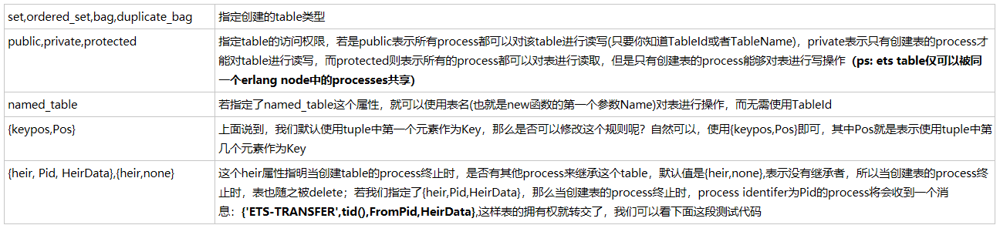
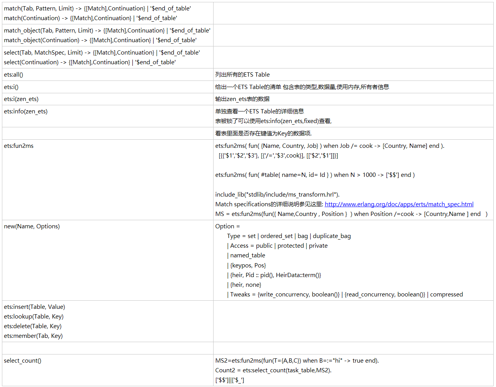
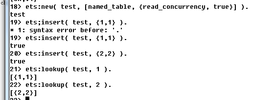

ETS基础     

ETS查询时间是常量,例外是如果使用ordered_set查询时间与logN成正比(N为存储的数据量)

ETS Table由进程创建,进程销毁ETS Table也随着销毁,在使用Shell做ETS实验的时候要注意一下,Table的拥有关系可以give_away 转交给其它进程

一个Erlang节点的ETS表的数量是有限制的,默认是1400个表,在启动erlang节点之前修改 ERL_MAX_ETS_TABLES参数可以修改这个限制ejabberd社区站点上总结的性能调优中提到了这一点,点击这里查看: 
http://www.ejabberd.im/tuning

ETS表不在GC的管理范围内，除非拥有它的进程死掉它才会终止；可以通过delete删除数据 

目前版本,insert和lookup操作都会导致对象副本的创建,insert和lookup时间对于set bag duplicate_bag都是常量值与表大小无关.

并发控制：所有针对一个对象的更新都被保证是原子的、隔离的：修改要么全部成功要么失败。也没有其它的中间结果被其它的进程使用。有些方法可以在处理多个对象的时候保证这种原子性和隔离性。

在数据库术语中隔离级别被称作序列化，就好像所有隔离的操作一个接一个严格按照顺序执行。

在遍历过程中,可以使用safe_fixtable来保证遍历过程中不出现错误,所有数据项只被访问一遍.用到逐一遍历的场景就很少，使用safe_fixtable的情景就更少。不过这个机制是非常有用的，还记得在.net中版本中很麻烦的一件事情就是遍历在线玩家用户列表.由于玩家登录退出的变化,这里的异常几乎是不可避免的.select match内部实现的时候都会使用safe_fixtable


```erlang
set,ordered_set,bag,duplicate_bag	指定创建的table类型

public,private,protected	指定table的访问权限，若是public表示所有process都可以对该table进行读写(只要你知道TableId或者TableName)，private表示只有创建表的process才能对table进行读写，而protected则表示所有的process都可以对表进行读取，但是只有创建表的process能够对表进行写操作（ps: ets table仅可以被同一个erlang node中的processes共享）

named_table	若指定了named_table这个属性，就可以使用表名(也就是new函数的第一个参数Name)对表进行操作，而无需使用TableId

{keypos,Pos}	上面说到，我们默认使用tuple中第一个元素作为Key，那么是否可以修改这个规则呢？自然可以，使用{keypos,Pos}即可，其中Pos就是表示使用tuple中第几个元素作为Key

{heir, Pid, HeirData},{heir,none}	这个heir属性指明当创建table的process终止时，是否有其他process来继承这个table，默认值是{heir,none},表示没有继承者，所以当创建表的process终止时，表也随之被delete；若我们指定了{heir,Pid,HeirData}，那么当创建表的process终止时，process identifer为Pid的process将会收到一个消息：{'ETS-TRANSFER',tid(),FromPid,HeirData},这样表的拥有权就转交了，我们可以看下面这段测试代码
```


```erlang
match(Tab, Pattern, Limit) -> {[Match],Continuation} | '$end_of_table'
match(Continuation) -> {[Match],Continuation} | '$end_of_table' 

match_object(Tab, Pattern, Limit) -> {[Match],Continuation} | '$end_of_table'
match_object(Continuation) -> {[Match],Continuation} | '$end_of_table'  

select(Tab, MatchSpec, Limit) -> {[Match],Continuation} | '$end_of_table' 
select(Continuation) -> {[Match],Continuation} | '$end_of_table' 

ets:all()
列出所有的ETS Table  
ets:i()
给出一个ETS Table的清单 包含表的类型,数据量,使用内存,所有者信息 
ets:i(zen_ets)
输出zen_ets表的数据
ets:info(zen_ets)
单独查看一个ETS Table的详细信息
表被锁了可以使用ets:info(zen_ets,fixed)查看, 

看表里面是否存在键值为Key的数据项. 
ets:fun2ms
ets:fun2ms( fun( {Name, Country, Job} ) when Job /= cook -> [Country, Name] end ). 
  [{{'$1','$2','$3'}, [{'/=','$3',cook}], [['$2','$1']]}] 
   
ets:fun2ms( fun( #table{ name=N, id= Id } ) when N > 1000 -> ['$$'] end ) 

include_lib("stdlib/include/ms_transform.hrl").
Match specifications的详细说明参见这里: http://www.erlang.org/doc/apps/erts/match_spec.html  
MS = ets:fun2ms(fun({ Name,Country , Position }  ) when Position /=cook -> [Country,Name ] end   )  
new(Name, Options)
Option = 
       Type = set | ordered_set | bag | duplicate_bag
       | Access = public | protected | private
       | named_table
       | {keypos, Pos}
       | {heir, Pid :: pid(), HeirData::term()}
       | {heir, none}
       | Tweaks = {write_concurrency, boolean()} | {read_concurrency, boolean()} | compressed
ets:insert(Table, Value)
ets:lookup(Table, Key)
ets:delete(Table, Key)
ets:member(Tab, Key) 


select_count()
MS2=ets:fun2ms(fun(T={A,B,C}) when B=:="hi" -> true end). 
Count2 = ets:select_count(task_table,MS2). 
['$$']||['$_']

```



[A Study of Erlang ETS Table Implementation and Performance](https://snapbrowse.com/browse.php/Oi8vd3d3/LmVybGFu/Zy5zZS93/b3Jrc2hv/cC8yMDAz/L3BhcGVy/L3A0My1m/cml0Y2hp/ZS5wZGY_/3D/b0/)

