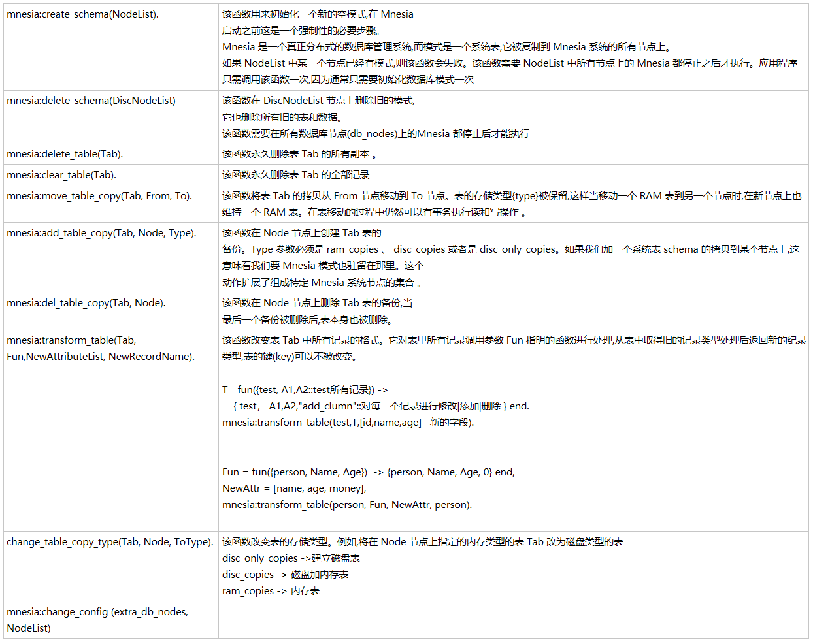

schema -> 分布式信息



```erlang
mnesia:create_schema(NodeList).	该函数用来初始化一个新的空模式,在 Mnesia
	启动之前这是一个强制性的必要步骤。
	Mnesia 是一个真正分布式的数据库管理系统,而模式是一个系统表,它被复制到 Mnesia 系统的所有节点上。
	如果 NodeList 中某一个节点已经有模式,则该函数会失败。该函数需要 NodeList 中所有节点上的 Mnesia 都停止之后才执行。应用程序只需调用该函数一次,因为通常只需要初始化数据库模式一次
mnesia:delete_schema(DiscNodeList)	该函数在 DiscNodeList 节点上删除旧的模式,
	它也删除所有旧的表和数据。
	该函数需要在所有数据库节点(db_nodes)上的Mnesia 都停止后才能执行
mnesia:delete_table(Tab).	该函数永久删除表 Tab 的所有副本 。
mnesia:clear_table(Tab).	该函数永久删除表 Tab 的全部记录
mnesia:move_table_copy(Tab, From, To).	该函数将表 Tab 的拷贝从 From 节点移动到 To 节点。表的存储类型{type}被保留,这样当移动一个 RAM 表到另一个节点时,在新节点上也维持一个 RAM 表。在表移动的过程中仍然可以有事务执行读和写操作 。
mnesia:add_table_copy(Tab, Node, Type).	该函数在 Node 节点上创建 Tab 表的
	备份。Type 参数必须是 ram_copies 、 disc_copies 或者是 disc_only_copies。如果我们加一个系统表 schema 的拷贝到某个节点上,这意味着我们要 Mnesia 模式也驻留在那里。这个
	动作扩展了组成特定 Mnesia 系统节点的集合 。
mnesia:del_table_copy(Tab, Node).	该函数在 Node 节点上删除 Tab 表的备份,当
	最后一个备份被删除后,表本身也被删除。
mnesia:transform_table(Tab, Fun,NewAttributeList, NewRecordName).	该函数改变表 Tab 中所有记录的格式。它对表里所有记录调用参数 Fun 指明的函数进行处理,从表中取得旧的记录类型处理后返回新的纪录类型,表的键(key)可以不被改变。
	
	T= fun({test, A1,A2::test所有记录}) ->  
	    { test， A1,A2,"add_clumn"::对每一个记录进行修改|添加|删除 } end. 
	mnesia:transform_table(test,T,[id,name,age]--新的字段).  
	 
	 
	Fun = fun({person, Name, Age})  -> {person, Name, Age, 0} end, 
	NewAttr = [name, age, money], 
	mnesia:transform_table(person, Fun, NewAttr, person).
	
change_table_copy_type(Tab, Node, ToType).	该函数改变表的存储类型。例如,将在 Node 节点上指定的内存类型的表 Tab 改为磁盘类型的表
	disc_only_copies ->建立磁盘表  
	disc_copies -> 磁盘加内存表  
	ram_copies -> 内存表
mnesia:change_config (extra_db_nodes, NodeList)	
```