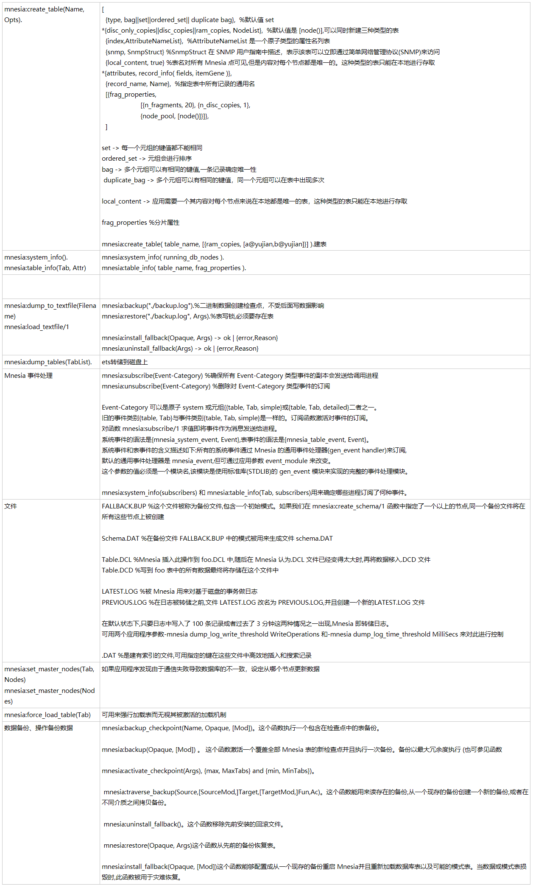

```erlang
mnesia:create_table(Name, Opts).
[
  {type, bag||set||ordered_set|| duplicate bag},  %默认值 set
*{disc_only_copies||disc_copies||ram_copies, NodeList},  %默认值是 [node()],可以同时新建三种类型的表
  {index,AttributeNameList},  %AttributeNameList 是一个原子类型的属性名列表
  {snmp, SnmpStruct} %SnmpStruct 在 SNMP 用户指南中描述，表示该表可以立即通过简单网络管理协议(SNMP)来访问
  {local_content, true} %表名对所有 Mnesia 点可见,但是内容对每个节点都是唯一的。这种类型的表只能在本地进行存取
*{attributes, record_info( fields, itemGene )},  
  {record_name, Name},  %指定表中所有记录的通用名
  [{frag_properties,
                     [{n_fragments, 20}, {n_disc_copies, 1},
                     {node_pool, [node()]}]},
  ]

set -> 每一个元组的键值都不能相同 
ordered_set -> 元组会进行排序 
bag -> 多个元组可以有相同的键值,一条记录确定唯一性 
 duplicate_bag -> 多个元组可以有相同的键值，同一个元组可以在表中出现多次 

local_content -> 应用需要一个其内容对每个节点来说在本地都是唯一的表，这种类型的表只能在本地进行存取

frag_properties %分片属性

mnesia:create_table( table_name, [{ram_copies, [a@yujian,b@yujian]}] ).建表
mnesia:system_info().
mnesia:table_info(Tab, Attr)
mnesia:system_info( running_db_nodes ). 
mnesia:table_info( table_name, frag_properties ).
 


mnesia:dump_to_textfile(Filename)  
mnesia:load_textfile/1
mnesia:backup("./backup.log").%二进制数据创建检查点，不受后面写数据影响 
mnesia:restore("./backup.log", Args).%表写锁,必须要存在表 

mnesia:install_fallback(Opaque, Args) -> ok | {error,Reason} 
mnesia:uninstall_fallback(Args) -> ok | {error,Reason}
mnesia:dump_tables(TabList).
ets转储到磁盘上
Mnesia 事件处理
mnesia:subscribe(Event-Category) %确保所有 Event-Category 类型事件的副本会发送给调用进程
mnesia:unsubscribe(Event-Category) %删除对 Event-Category 类型事件的订阅

Event-Category 可以是原子 system 或元组{{table, Tab, simple}或{table, Tab, detailed}二者之一。
旧的事件类别{table, Tab}与事件类别{table, Tab, simple}是一样的。订阅函数激活对事件的订阅。
对函数 mnesia:subscribe/1 求值即将事件作为消息发送给进程。
系统事件的语法是{mnesia_system_event, Event},表事件的语法是{mnesia_table_event, Event}。
系统事件和表事件的含义描述如下:所有的系统事件通过 Mnesia 的通用事件处理器(gen_event handler)来订阅,
默认的通用事件处理器是 mnesia_event,但可通过应用参数 event_module 来改变。
这个参数的值必须是一个模块名,该模块是使用标准库(STDLIB)的 gen_event 模块来实现的完整的事件处理模块。

mnesia:system_info(subscribers) 和 mnesia:table_info(Tab, subscribers)用来确定哪些进程订阅了何种事件。
文件
FALLBACK.BUP %这个文件被称为备份文件,包含一个初始模式。如果我们在 mnesia:create_schema/1 函数中指定了一个以上的节点,同一个备份文件将在所有这些节点上被创建

Schema.DAT %在备份文件 FALLBACK.BUP 中的模式被用来生成文件 schema.DAT

Table.DCL %Mnesia 插入此操作到 foo.DCL 中,随后在 Mnesia 认为.DCL 文件已经变得太大时,再将数据移入.DCD 文件 
Table.DCD %写到 foo 表中的所有数据最终将存储在这个文件中

LATEST.LOG %被 Mnesia 用来对基于磁盘的事务做日志
PREVIOUS.LOG %在日志被转储之前,文件 LATEST.LOG 改名为 PREVIOUS.LOG,并且创建一个新的LATEST.LOG 文件

在默认状态下,只要日志中写入了 100 条记录或者过去了 3 分钟这两种情况之一出现,Mnesia 即转储日志。
可用两个应用程序参数-mnesia dump_log_write_threshold WriteOperations 和-mnesia dump_log_time_threshold MilliSecs 来对此进行控制

.DAT %是建有索引的文件,可用指定的键在这些文件中高效地插入和搜索记录
mnesia:set_master_nodes(Tab,
Nodes)
mnesia:set_master_nodes(Nodes)
如果应用程序发现由于通信失败导致数据库的不一致，设定从哪个节点更新数据
mnesia:force_load_table(Tab)
可用来强行加载表而无视其被激活的加载机制
数据备份、操作备份数据
mnesia:backup_checkpoint(Name, Opaque, [Mod])。这个函数执行一个包含在检查点中的表备份。

mnesia:backup(Opaque, [Mod]) 。 这个函数激活一个覆盖全部 Mnesia 表的新检查点并且执行一次备份。备份以最大冗余度执行 (也可参见函数

mnesia:activate_checkpoint(Args), {max, MaxTabs} and {min, MinTabs})。

 mnesia:traverse_backup(Source,[SourceMod,]Target,[TargetMod,]Fun,Ac)。这个函数能用来读存在的备份,从一个现存的备份创建一个新的备份,或者在不同介质之间拷贝备份。

 mnesia:uninstall_fallback()。这个函数移除先前安装的回滚文件。

 mnesia:restore(Opaque, Args)这个函数从先前的备份恢复表。

mnesia:install_fallback(Opaque, [Mod])这个函数能够配置成从一个现存的备份重启 Mnesia并且重新加载数据库表以及可能的模式表。当数据或模式表损毁时,此函数被用于灾难恢复。

```