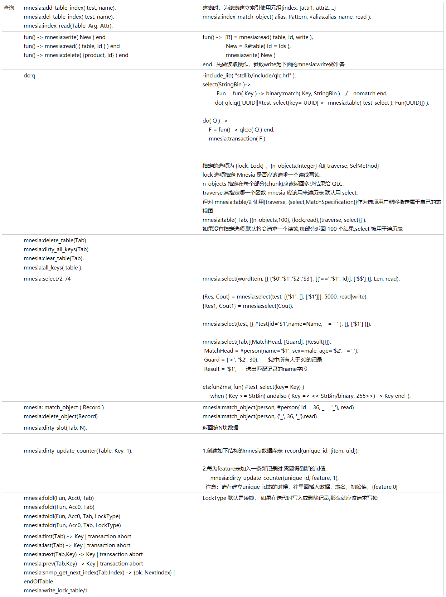

```erlang
查询
mnesia:add_table_index( test, name). 
mnesia:del_table_index( test, name). 
mnesia:index_read(Table, Arg, Attr).
建表时，为该表建立索引使用元组{index, [attr1, attr2,....}
mnesia:index_match_object( alias, Pattern, #alias.alias_name, read ).

fun() -> mnesia:write( New ) end 
fun() -> mnesia:read( { table, Id } ) end 
fun() -> mnesia:delete( {product, Id} ) end 
fun() ->  [R] = mnesia:read( table, Id, write ), 
               New = R#table{ Id = Ids }, 
               mnesia:write( New ) 
end.  先做读取操作，参数write为下面的mnesia:write做准备

do:q 
-include_lib( "stdlib/include/qlc.hrl" ). 
select(StringBin )-> 
         Fun = fun( Key ) -> binary:match( Key, StringBin ) =/= nomatch end, 
        do( qlc:q([ UUID||#test_select{key= UUID} <- mnesia:table( test_select ), Fun(UUID)]) ). 

do( Q ) -> 
    F = fun() -> qlc:e( Q ) end, 
    mnesia:transaction( F ). 


指定的选项为 {lock, Lock} 、{n_objects,Integer} 和{ traverse, SelMethod}
lock 选项指定 Mnesia 是否应该请求一个读或写锁,
n_objects 指定在每个部分(chunk)应该返回多少结果给 QLC。
traverse,其指定哪一个函数 mnesia 应该用来遍历表,默认用 select。
但对 mnesia:table/2 使用{traverse, {select,MatchSpecification}}作为选项用户能够指定属于自己的表视图
mnesia:table( Tab, [{n_objects,100}, {lock,read},{traverse, select}] ).
如果没有指定选项,默认将会请求一个读锁,每部分返回 100 个结果,select 被用于遍历表

mnesia:delete_table(Tab) 
mnesia:dirty_all_keys(Tab) 
mnesia:clear_table(Tab). 
mnesia:all_keys( table ). 


mnesia:select/2, /4 


   
mnesia:select(wordItem, [{ {'$0','$1','$2','$3'}, [{'==','$1', Id}], ['$$'] }], Len, read). 

{Res, Cout} = mnesia:select(test, [{'$1', [], ['$1']}], 5000, read|write).
{Res1, Cout1} = mnesia:select(Cout).

mnesia:select(test, [{ #test{id='$1',name=Name, _ = '_' }, [], ['$1'] }]). 

mnesia:select(Tab,[{MatchHead, [Guard], [Result]}]).
 MatchHead = #person{name='$1', sex=male, age='$2', _='_'}, 
 Guard = {'>', '$2', 30},      $2中所有大于30的记录 
 Result = '$1',      选出匹配记录的name字段 

ets:fun2ms( fun( #test_select{key= Key} ) 
     when ( Key >= StrBin) andalso ( Key =< << StrBin/binary, 255>>) -> Key end  ), 

mnesia: match_object ( Record ) 
mnesia:delete_object(Record)
mnesia:match_object(person, #person{ id = 36, _ = '_'}, read)         
mnesia:match_object(person, {'_', 36, '_'},read)

mnesia:dirty_slot(Tab, N). 
返回第N块数据


mnesia:dirty_update_counter(Table, Key, 1).
1.创建如下结构的mnesia数据库表-record(unique_id, {item, uid}); 

2.每为feature表加入一条新记录时,需要得到新的id值: 
     mnesia:dirty_update_counter(unique_id, feature, 1), 
  注意：请在建立unique_id表的时候，往里面插入数据，表名，初始值，{feature,0}

mnesia:foldl(Fun, Acc0, Tab)
mnesia:foldr(Fun, Acc0, Tab)
mnesia:foldl(Fun, Acc0, Tab, LockType)
mnesia:foldr(Fun, Acc0, Tab, LockType)
LockType 默认是读锁， 如果在迭代时写入或删除记录,那么就应该请求写锁

mnesia:first(Tab) -> Key | transaction abort
mnesia:last(Tab) -> Key | transaction abort
mnesia:next(Tab,Key) -> Key | transaction abort
mnesia:prev(Tab,Key) -> Key | transaction abort
mnesia:snmp_get_next_index(Tab,Index) -> {ok, NextIndex} | endOfTable
mnesia:write_lock_table/1
```