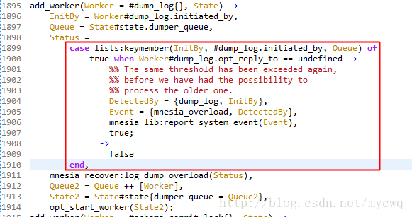
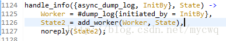
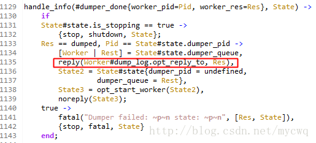
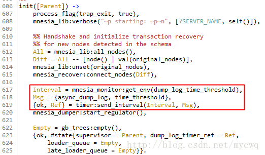
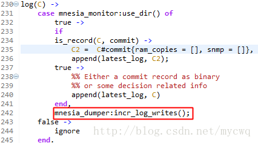
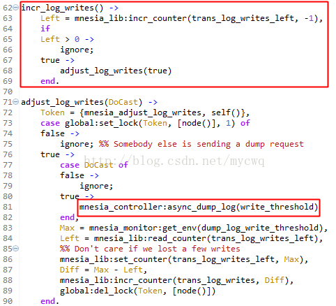
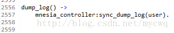
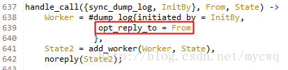

dump_log_time_threshold %转储间隔次数
dump_log_write_threshold %转储次数
dc_dump_limit %出发dump的默认值，当filesize(*.DCL) > filesize(*.DCD) / dc_dump_limit，把*.DCL的记录存储到*.DCD文件中

application:set_env( mnesia, dc_dump_limit, 40 ),
application:set_env( mnesia, dump_log_write_threshold, 10000 ),

mnesia在频繁操作数据的过程可能会报错：** WARNING ** Mnesia is overloaded: {dump_log, write_threshold}，可以看出，mnesia应该是过载了。这个警告在mnesia dump操作会发生这个问题，表类型为disc_only_copies 、disc_copies都可能会发生。
如何重现这个问题，例子的场景是多个进程同时在不断地mnesia:dirty_write/2
mnesia过载分析
1、抛出警告是在mnesia 增加dump worker的时候

     mnesia_controller.erl

抛出警告是当Worker的#dump_log.opt_reply_to 未定义，仔细看这里的代码，这一步先检查了dumper_queue里的worker
所以，mnesia抛出过载警告有2个条件：
  1）当worker的#dump_log.opt_reply_to 未定义
  2）dumper_queue有相同操作（InitBy）的worker

2、那什么样的worker的#dump_log.opt_reply_to 未定义？

代码也在mnesia_controller.erl，这里add的worker的dump_log.opt_reply_to 未定义，而{async_dump_log, InitBy} 就是 mnesia:dirty_write/2的过程中调用 mnesia_controller:async_dump_log(write_threshold) 产生的。

就是说，mnesia:dirty_write/2会触发异步dump操作，而只有异步的dump会导致mnesia抛出过载警告

3、看一下，mnesia什么时候会修正worker？

代码也在mnesia_controller.erl，在dump完成时，mnesia会修改worker的dump_log.opt_reply_to，然后移出dumper_queue
 
从上面可以得到结论，mnesia:dirty_write/2的操作是会触发异步dump操作，每次dump操作mnesia都会加到dumper_queue队列，mnesia通过检查dumper_queue是否存有相同操作的worker来检查是否过载
mnesia dump分析
mnesia数据存储实际上使用的是ets和dets，对于ram_copies类型的表使用ets；disc_copies表也使用ets，通过 dump将数据保存到*.DCD（disc copy data）文件来持久化，中间可能会用*.DCL（disc copy log）转储；而disc_only_copies表使用的是dets，保存的文件为*.DAT。
表类型不同，mnesia记录数据的过程也不同，这里先讨论mnesia 记录disc_copies数据的过程。
1、mnesia 记录disc_copies数据有2个过程：
   1）操作先记录到日志文件LATEST.LOG，然后再dump到*.DCD文件，同时清除LATEST.LOG
   2）把修改同步到ets表中
2、mnesia disc_copies表数据dump过程
   1）将日志文件LATEST.LOG重命名为PREVIOUS.LOG，然后再新建一个空的日志文件LATEST.LOG
   2）分析PREVIOUS.LOG文件中的内容，将disc_copies的表实际修改写到*.DCL文件
   3）比较*.DCL和*.DCD的大小，当filesize(*.DCL) > filesize(*.DCD) / dc_dump_limit，把*.DCL的记录存储到*.DCD文件中。dc_dump_limit默认为4，可以通过-mnesia dc_dump_limit Number设置
3、mnesia什么时候会dump
  1）定时触发
   mnesia启动后，mnesia_controller进程设置定时器，触发dump
   mnesia_controller.erl:

默认值为180000，可以通过 -mnesia dump_log_time_threshold 300000 设置。
  2）一定次数的操作后触发
     每次数据操作，mnesia都会调用mnesia_log:log/1或者mnesia_log:slog/1进行日志记录，记录一次日志就将trans_log_writes_left的值减1，当这个值为0时，触发dump
     mnesia_log.erl:

mnesia_dumper.erl 

默认值为1000，可以通过 -mnesia dump_log_write_threshold 50000 设置。
  3）手动dump
   手动调用 mnesia:dump_log/0  可以强制mnesia 完成dump，而这个dump是同步的
   mnesia.erl:

mnesia_controller.erl:

解决mnesia过载
结合上面的分析再谈谈mnesia过载问题，dict_copies表写数据的时候，mnesia会写记录到ets表和日志文件 LATEST.LOG，然后定时或定量dump做持久化。通过dump_log_write_threshold /dump_log_time_threshold 可以控制持久化的频率。mnesia在dump数据的时候，如果上一个worker进程dump没完成，就抛出过载警告。对 此，dump_log_write_threshold的值表示mnesia经历过多少数据操作做一次持久 化，dump_log_time_threshold的值表示mnesia多长时间做一次持久化。

这里再谈谈，为何同一时间只能有一个dumper？

dump的过程是先将日志文件重命名为PREVIOUS.LOG，然后分析PREVIOUS.LOG的数据做持久化，如果同时有第二个dump，将 会替换掉第一个dump的PREVIOUS.LOG，影响第一个dump的持久化。那么，聪明的你就会这么想，为何不重命名为XXX.LOG，每次重命名 都不同？事实上，如果同时有两个dumper，mnesia仅保证第二个dump能正常进行，放弃掉第一个dump的数据。所以，mnesia出现过载警告的时候，数据有可能会丢失。

这里，我做过了一项测试，修改mnesia的代码，将所有异步dump去掉，改用定时手动dump。还是原来的例子，发现第一个dump还没完成日志文件的分析和持久化，而新的日志文件已经增长到快2G。

dump的过程在文件io层面上其实是，一边在没有控制的追加数据，一边又在分析文件和有序写入，这个过程是在挑战磁盘io的读写极限啊。所以，就算现在有多个dumper，结果只会让cpu和硬盘更加抓狂。

另外，别太过依赖dump_log_write_threshold/dump_log_time_threshold这两个参数，改大了就有用吗？

这两个参数改大了，就是说，dump的频率就会降低，那么等待dump的数据就会更多，dump花的时间将会越长，到头来还是不能解决到问题。这两 个参数的意义在于平缓写入速度，避免一时间大量数据写入造成数据丢失。但是，如果每时每刻都是高密度写入，硬盘也承受不了，一般到了这个局面，问题应该从 数据缓冲和持久化的设计上去解决，而不是想着换一个数据库去解决。

这里有一点经验可以分享一下：
1、在mnesia没报过载错误的时候，不建议去改动，调节这些参数会影响持久化
2、可以多个进程读mnesia的数据，但写数据的过程只交给少数几个进程去完成
参考：
http://blog.csdn.net/mycwq/article/details/28660813
http://my.oschina.net/hncscwc/blog/161763

来自 <http://blog.csdn.net/mycwq/article/details/28660813?utm_source=tuicool> 
