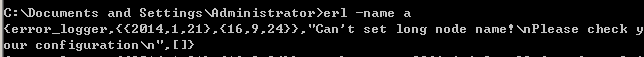
解决方案：erl -name a@yujian

1.在两台机器上分别建立各自一个节点，我使用我的电脑和我后面的电脑
 
    我的机器                                                            test机器
        
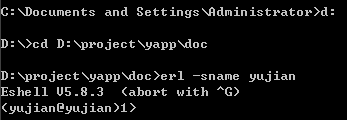
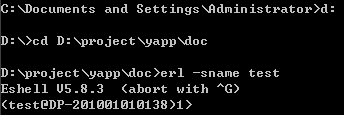
       

    这时运行：
     mnesia:create_schema( [ yujian@yujian, test@DP-201001010138 ]).出现错误
    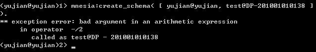

我猜测可能是test@DP-201001010138这个名称的问题，把这个名称修改掉，修改成test@test
    然后重新试验下
    2台机器之间有错误了    
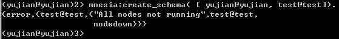

该问题，出现原因未知

第二次试验信息：a机器：erl -name a@yujian -setcookie abc
                b机器:erl -name b@yujian -setcookie abc
此次解决方案：a机器代码修改：erl -sname a -setcookie abc
              b不变化
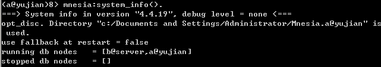

这时我准备在我的机器上启2个节点
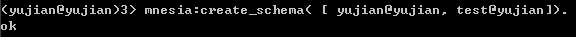
    

ok
  这时mnesia:start().需要注意
然后创建表
    mnesia:create_table( baikefileRecord, [{disc_only_copies, [ yujian@yujian, test@yujian ]},
 {attributes, record_info( fields, baikefileRecord )}]).

mnesia:start().
mnesia:system_info().
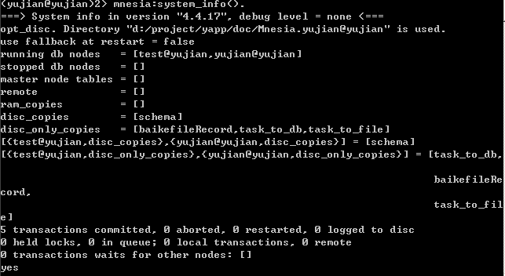
以task_to_file表为例，首先确保2个节点上的这张表都为空，
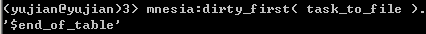
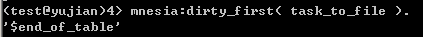

然后向一个节点的表中插入数据，我想yujian@yujian这个节点中插入了10条数据，选择出来
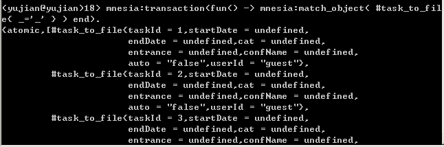
然后再test@yujian节点上查看这个节点上现在是否有数据  
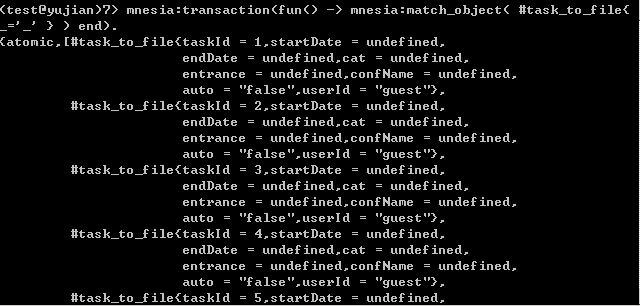
悲剧了同步更新了
在没有插入数据的节点上删除操作，更新操作，都会同步更新所有的节点
        
好吧现在的结论是：分布式的节点中每一张的数据都会更新成同样的数据

细节
关闭已经打开的yaws服务器
第一台机器(hz-ejabberd-web1)
进入到/home/project/文件夹下
yaws --sname computera --mnesiadir /httx/project/Mnesia.nonode@nohost --erlarg "-setcookie wexin"
进入yaws后，前缀
执行下面函数
mnesia:stop().
mnesia:delete_schema( [computera@yujian] ).
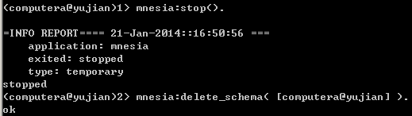
测试 http://127.0.0.1:8081/down.yaws,可以打开
在另一台机器
进入到/home/project/文件夹下
yaws --sname computerb --mnesiadir /httx/project/Mnesia.nonode@nohost --erlarg "-setcookie wexin"
进入yaws后，前缀
执行下面函数
mnesia:stop().
mnesia:delete_schema( [computerb@server] ).
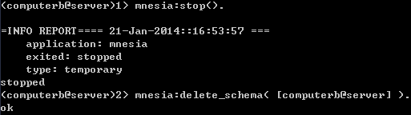
测试 http://127.0.0.1:8081/down.yaws,可以打开
运行
mnesia:create_schema( [computera@yujian, computerb@server]).
 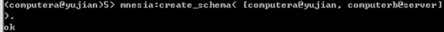

运行
mnesia:system_info().
 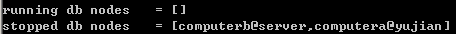

如图所示stopped db nodes 包括两项第四步才算成功
运行
分别在两台机器上运行：
mnesia:start().
运行完成后，在第一台机器上执行：
mnesia:system_info().
 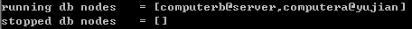

如图所示running db nodes 包括两项才算成功
在第一台机器上运行
mnesiaDBA_init:init( computerb@server,computera@yujian ).
 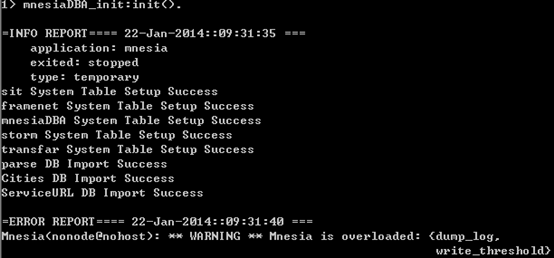
 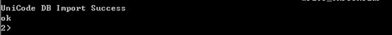