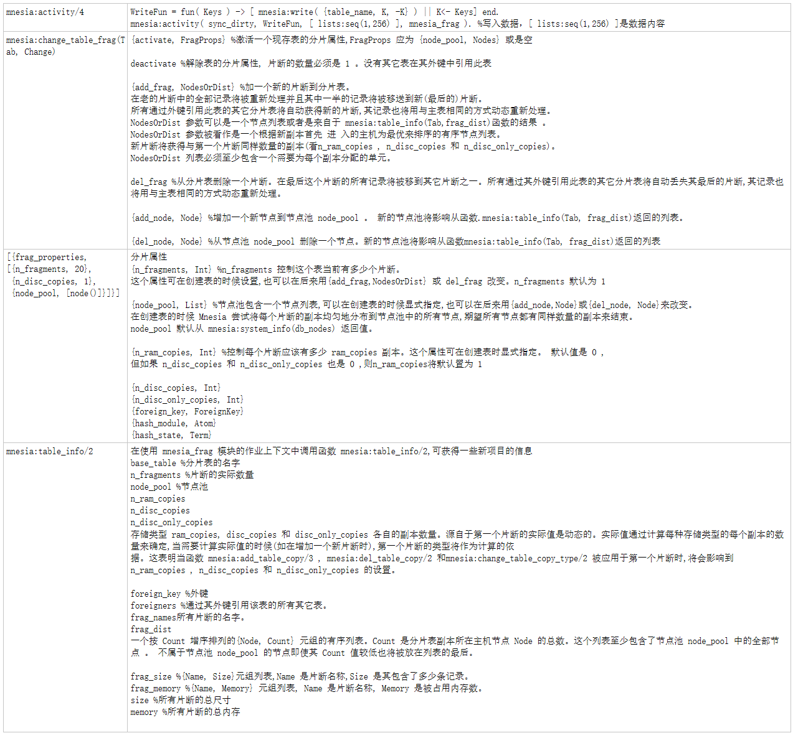
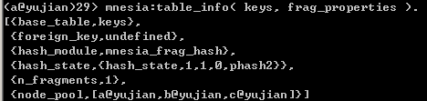
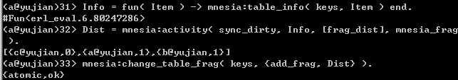

数据分片：本质把一张表分成多张表，
当使用mnesia:activity/4操作数据时，分片属性被使用，会到多张表中进程操作



```erlang
mnesia:activity/4
WriteFun = fun( Keys ) -> [ mnesia:write( {table_name, K, -K} ) || K<- Keys] end.
mnesia:activity( sync_dirty, WriteFun, [ lists:seq(1,256) ], mnesia_frag ). %写入数据，[ lists:seq(1,256) ]是数据内容
mnesia:change_table_frag(Tab, Change)

{activate, FragProps} %激活一个现存表的分片属性,FragProps 应为 {node_pool, Nodes} 或是空

deactivate %解除表的分片属性, 片断的数量必须是 1 。没有其它表在其外键中引用此表

{add_frag, NodesOrDist} %加一个新的片断到分片表。
在老的片断中的全部记录将被重新处理并且其中一半的记录将被移送到新(最后的)片断。
所有通过外键引用此表的其它分片表将自动获得新的片断,其记录也将用与主表相同的方式动态重新处理。
NodesOrDist 参数可以是一个节点列表或者是来自于 mnesia:table_info(Tab,frag_dist)函数的结果 。
NodesOrDist 参数被看作是一个根据新副本首先 进 入的主机为最优来排序的有序节点列表。
新片断将获得与第一个片断同样数量的副本(看n_ram_copies , n_disc_copies 和 n_disc_only_copies)。
NodesOrDist 列表必须至少包含一个需要为每个副本分配的单元。

del_frag %从分片表删除一个片断。在最后这个片断的所有记录将被移到其它片断之一。所有通过其外键引用此表的其它分片表将自动丢失其最后的片断,其记录也将用与主表相同的方式动态重新处理。

{add_node, Node} %增加一个新节点到节点池 node_pool 。 新的节点池将影响从函数.mnesia:table_info(Tab, frag_dist)返回的列表。

{del_node, Node} %从节点池 node_pool 删除一个节点。新的节点池将影响从函数mnesia:table_info(Tab, frag_dist)返回的列表
[{frag_properties, 
[{n_fragments, 20}, 
 {n_disc_copies, 1}, 
 {node_pool, [node()]}]}] 

分片属性
{n_fragments, Int} %n_fragments 控制这个表当前有多少个片断。
这个属性可在创建表的时候设置,也可以在后来用{add_frag,NodesOrDist} 或 del_frag 改变。n_fragments 默认为 1

{node_pool, List} %节点池包含一个节点列表,可以在创建表的时候显式指定,也可以在后来用{add_node,Node}或{del_node, Node}来改变。 
在创建表的时候 Mnesia 尝试将每个片断的副本均匀地分布到节点池中的所有节点,期望所有节点都有同样数量的副本来结束。
node_pool 默认从 mnesia:system_info(db_nodes) 返回值。

{n_ram_copies, Int} %控制每个片断应该有多少 ram_copies 副本。这个属性可在创建表时显式指定。 默认值是 0 ,  
但如果 n_disc_copies 和 n_disc_only_copies 也是 0 ,则n_ram_copies将默认置为 1 

{n_disc_copies, Int}
{n_disc_only_copies, Int}
{foreign_key, ForeignKey}
{hash_module, Atom}
{hash_state, Term}
mnesia:table_info/2
在使用 mnesia_frag 模块的作业上下文中调用函数 mnesia:table_info/2,可获得一些新项目的信息
base_table %分片表的名字
n_fragments %片断的实际数量
node_pool %节点池
n_ram_copies
n_disc_copies
n_disc_only_copies
存储类型 ram_copies, disc_copies 和 disc_only_copies 各自的副本数量。源自于第一个片断的实际值是动态的。实际值通过计算每种存储类型的每个副本的数量来确定,当需要计算实际值的时候(如在增加一个新片断时),第一个片断的类型将作为计算的依
据。这表明当函数 mnesia:add_table_copy/3 , mnesia:del_table_copy/2 和mnesia:change_table_copy_type/2 被应用于第一个片断时,将会影响到n_ram_copies , n_disc_copies 和 n_disc_only_copies 的设置。

foreign_key %外键
foreigners %通过其外键引用该表的所有其它表。
frag_names所有片断的名字。
frag_dist
一个按 Count 增序排列的{Node, Count} 元组的有序列表。Count 是分片表副本所在主机节点 Node 的总数。这个列表至少包含了节点池 node_pool 中的全部节点 。 不属于节点池 node_pool 的节点即使其 Count 值较低也将被放在列表的最后。

frag_size %{Name, Size}元组列表,Name 是片断名称,Size 是其包含了多少条记录。
frag_memory %{Name, Memory} 元组列表, Name 是片断名称, Memory 是被占用内存数。
size %所有片断的总尺寸
memory %所有片断的总内存
```



```erlang
Info = fun( Item ) -> mnesia:table_info( table_name, Item ) end.
Dist = mnesia:activity( sync_dirty, Info, [frag_dist], mnesia_frag).

mnesia:change_table_frag( table_name, {add_frag, Dist} ). %分表，把整个表分开。
```
   
```erlang
mnesia:change_table_frag( table_name, {add_frag, Dist} ).---继续分
```