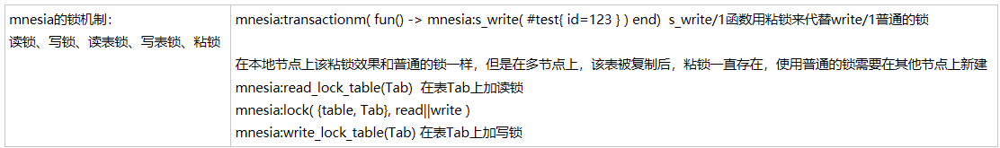

读锁。在记录的副本能被读取之前设置读锁。.
 
写锁。当事务写一条记录时,首先在这条记录的所有副本上设置写锁。

 读表锁。如果事务要扫描整张表来搜索一条记录,那么,对表里的记录一条一条的加锁效率很低也很耗内存(如果表很大,读锁本身会消耗很多空间)。因此,Mnesia 可以对表设
置读锁。
 
写表锁。如果事务要写大量的记录到表里,则可以对整张表设置写锁。
 
粘(Sticky)锁。即使设置锁的事务终止后,这些写锁也会一直保留在节点上。



```erlang
mnesia的锁机制：
读锁、写锁、读表锁、写表锁、粘锁 

mnesia:transactionm( fun() -> mnesia:s_write( #test{ id=123 } ) end)  s_write/1函数用粘锁来代替write/1普通的锁 

在本地节点上该粘锁效果和普通的锁一样，但是在多节点上，该表被复制后，粘锁一直存在，使用普通的锁需要在其他节点上新建 
mnesia:read_lock_table(Tab)  在表Tab上加读锁     
mnesia:lock( {table, Tab}, read||write ) 
mnesia:write_lock_table(Tab) 在表Tab上加写锁

```